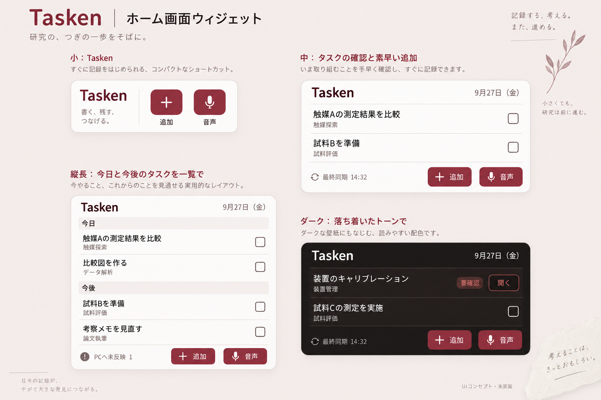
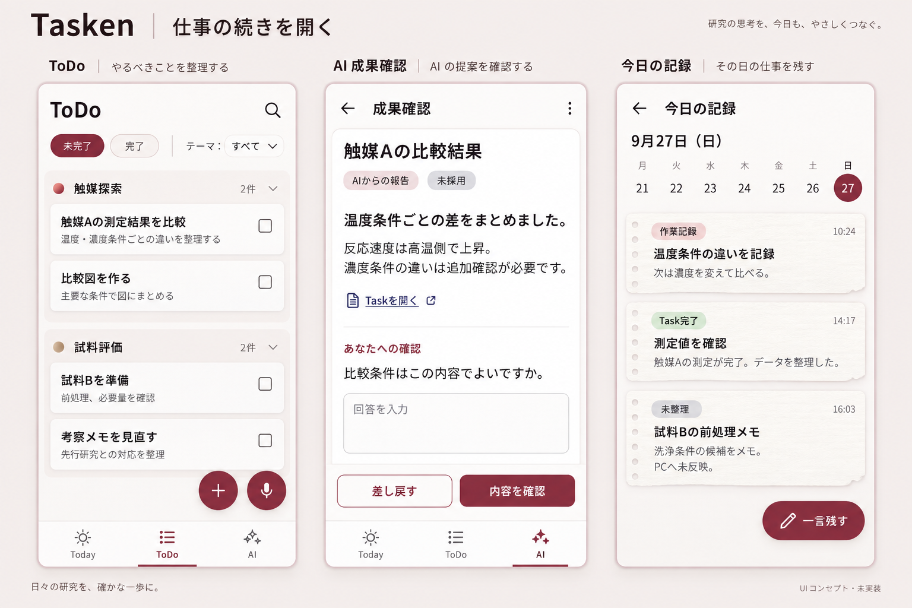

# Android Tasken：追加画面コンセプト

2026-09-27。後続検討用の画像資料です。**画像だけを根拠に実装範囲を増やさないでください。**
初期実装と未着手範囲は[改善計画](plan-2026-09-27.md)、当初の境界は[実装引き継ぎ](implementation-handoff-2026-09-27.md)を参照してください。

## ウィジェット

別方向の探索：[ペルソナ５のUI概念から考える「意志のある操作」](kinetic-direction.md)。利用者の追加の関心を画像化した比較案です。採用は未確定で、進行中の実装方針を切り替える指示ではありません。

ホーム画面から「追加する・話す・仕事へ戻る」を短くする案です。現在の `TaskenTodayWidget.kt` のサイズ別表示、Task一覧、音声入口、未反映・競合の表示を基にしています。
小サイズは入口に集中し、広いサイズではTaskを読めるようにします。ホスト側のサイズ区分と実際のdp寸法は現行実装で決まり、画像の面積比から実装値を逆算しません。

## ToDo・AI成果確認・今日の記録

ToDoは探して戻れる一覧、AIは報告本文と人の判断、記録は読み返したくなる手帳という役割を描き分けています。
同じバーガンディ、本文の読みやすさ、右側の操作を共通にします。

## 実装者向けの読み方

- 架空の研究データによる生成画像です。画面、機能、文字列、保存結果の実動確認ではありません。
- 画像より現行契約とデザイントークンを優先します。画像内の装飾、件数、フィルタ、Themeとの関連付けを追加要件にしません。
- ウィジェットは現在のRemoteViewsの制約内で設計します。アプリ内の保存アニメーションをそのまま要求しません。
- 未反映・競合・Work Receipt確認が必要なTaskは、現在の直接完了可否の判定を保ちます。画像のチェックボックスを理由に有効化しません。
- AIの「内容を確認」は画像上の仮の入口です。実操作は現行の報告閲覧→明示的な「承認して完了」等の契約へ合わせます。回答送信と承認を混同せず、オフラインで承認成功を表示しません。
- RecallはTodayから開く画面です。AIタブへ移設しません。作業記録・Task完了・未整理・AI報告・採用の区別を保ちます。
- 文字の崩れ、装飾的な小文、影、紙の重なりはそのまま採用せず、狭幅・文字拡大・ダークの読みやすさを優先します。

画像の生成方式は内蔵image_gen。再生成用の全文プロンプトは[生成プロンプト](prompts.md)に保存しています。
両画像を生成後に目視確認しました。構成比較には使えますが、次の補正を前提とします。

- ウィジェットの「9月27日（金）」は誤り。2026年9月27日は日曜です。実装では端末の暦日から導出します。
- 小ウィジェットの説明文、ボード外の植物やコピーは雰囲気づくりです。実装はTasken名と操作入口を優先します。
- ダークの「要確認」は画像上コントラストが弱いため、その色を採用せず既存トークンで可読性を検証します。
- AI画面では「回答を送る」が生成画像から抜けています。回答欄を設ける場合は対応する送信操作を必ず維持します。
- AI画面の青い「Taskを開く」は共通の操作色へ合わせます。報告の閲覧、質問への回答、承認の操作はそれぞれ現行状態に応じて表示します。
- 記録の並びやTask完了に付いた説明は架空の作例です。現行の並び順と実データの本文・種別を正本にします。

## 確認の境界

アプリの実装・起動・実機検証はこの追加資料作成では行いません。触覚、押しやすさ、IME表示中の位置、ホームアプリのサイズ制約は実装時に別途検証してください。
