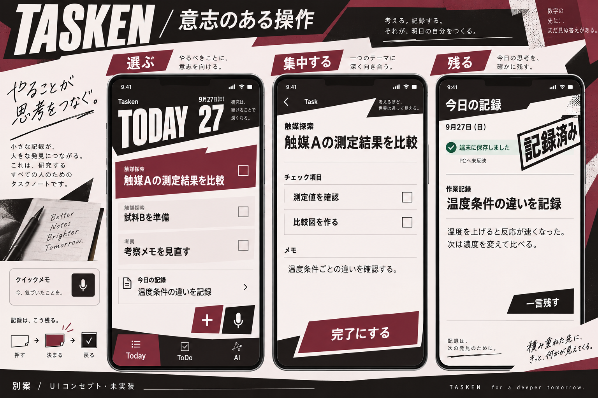

# Tasken別案：意志のある操作

2026-09-27。ユーザーの「ペルソナ５のUIの概念を流用したい」を受けた探索案。**採用未確定・未実装。進行中の手帳案の実装を変更する指示ではない。**

## この案で狙うこと

触ることそのものに、決断した手応えを作る。
研究の中身は落ち着いて読み、選択・完了・保存の瞬間に強いアクセントを置く。
前案の「記録を眺めたい」に、「この操作を決めたい」を加える。

ユーザーが挙げた参照作品：[Persona 5 Royal公式サイト](https://persona.atlus.com/p5r/)。
以下はTasken向けの設計提案であり、作品の設計意図や動作時間を調査して断定したものではない。

## 概念の翻訳

| 借りたい考え方           | Taskenでの表現                                       | 操作上の境界                                                     |
| ------------------------ | ---------------------------------------------------- | ---------------------------------------------------------------- |
| 選択したものが主役になる | 選択行だけにバーガンディの斜めの下地と強い文字の対比 | 強調はfocus・選択の意味。未完了を完了済みに見せない              |
| 文字を画面の骨格にする   | TODAY・日付・Task名のサイズ差で視線を運ぶ            | 日付を巨大化して仕事を画面外へ押し出さない。長い日本語本文は水平 |
| 構図に方向がある         | 見出し端・選択の背景・確定ボタン周囲に角度を付ける   | 読む行、タップ領域、スクロール軸は整列させる                     |
| 操作の前後が決まる       | 押す→短い反応→静止、という一度の動き                 | 保存前に成功を出さない。次の入力を演出で待たせない               |
| 全体に同じ文法がある     | 同じ選択表現をToday、ToDo、ウィジェットに展開        | 画面ごとの別ルールや、実装不能なウィジェット演出を増やさない     |

コピーする対象は特定のメニュー配置ではなく、情報の強弱と反応の設計。
TaskenではTask・Theme・記録が主役であり、ゲームの用語やキャラクターを持ち込む必要はない。

## 強さの置き場所

- **平常時**：本文と一覧は静か。常時揺れ、流れる背景、繰り返す光は置かない。
- **選択時**：一つの面だけを強くする。画面全体を派手にして主役を失わせない。
- **操作成功時**：短い反応を一度だけ出す。端末保存・PC反映・採用を別の状態として示す。
- **失敗時**：入力を保持し、その場所で直せる。劇的な演出で理由や復旧操作を隠さない。

例えば、120msの押下反応と180msの状態変化を既存トークンで試す。
数字は試作の出発点で、Persona 5の実測値ではない。
完了の反応中もタッチ処理や保存処理を待たせず、一覧の位置を保つ。
動き抑制時は最終の選択枠・チェック・文字だけで成立させる。触覚は端末設定に従う。

## 既存標準との関係

バーガンディ、状態の意味、読みやすさ、右手操作、保存契約を継承する。
大胆な斜めの面、角張った外形、強い見出し書体は、現在の「丸ゴシック・控えめ角丸」を越える**デザイン標準の変更候補**である。
画像の生成はこの方向を比較するための探索であり、共通標準は変更していない。

採用するなら、まず「選択の背景と完了の手応え」の小さな動く試作で読みやすさと快感を評価する。
全面的なテーマ変更や全画面改修は、その結果を見て決める。
最初から全てを斜めにすると、研究の本文を読むアプリとしては使いにくくなる。

## 次に判断すること

生成画像を目視すると、前案より操作の主張は強くなった。一方、TODAYと日付の占有面積、保存印、飾り文は大きすぎる。採用時は見出しを縮め、Taskの表示領域を取り戻す。画面外のコピー・端末枠・写真は説明用の装飾で、アプリへ持ち込まない。
一覧のテーマ名やタブアイコンは生成による仮表現なので実データと既存アイコンを使う。右下の黒い「一言残す」も、操作色のバーガンディへ統一する。
静止画では反応の速さや手応えは判断できない。この案の本命は次の動く試作で確かめる。

1. 前案と同じ架空データでTodayを並べ、Taskと入力入口を探す負荷を比較する。
2. 狭いFoldカバー、長いタイトル、文字拡大、ダーク、片手操作で確かめる。
3. 選択→完了の動きが「気持ちいい」と「毎回見るにはうるさい」のどちらに寄るか本人が試す。
4. 画像では示せない触覚・応答時間・保存失敗・戻ったときのfocusを隔離環境で確認する。

コード、デザイン標準、実データへの変更なし。別AIが進めている実装ファイルには触れていない。
画像は内蔵image_genによる生成物。本文・状態・タッチ領域の実動確認ではない。
再生成用の全文は[生成プロンプト](kinetic-prompt.md)を参照。
