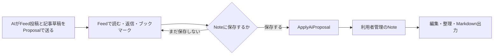

# Feed中心のSNS体験をTaskenへ統合する実装計画

更新日: 2026-09-22

この文書は、[Feed UX改善案](./feed-ux-improvement-plan-2026-09-22.md)と[14画面の画像コンセプト](../output/imagegen/tasken-sns-concepts-2026-09-22/index.html)を見たあとの判断を、実装順へ落としたものである。
以前の計画と判断が異なる場合は、この文書を今回の実装判断として優先する。

## 目標

TaskenのFeedを、自分とAIたちが仕事の途中で得た発見を持ち寄る、小さなSNSとして育てる。
利用者は委任した仕事の進捗を追うだけでなく、そこで得られた技術、判断、失敗、参考資料を読み、自分の学びとして持ち帰れる。

画面の基調には「ホーム A — 軽快なSNS」を採用する。
明るい面、投稿者が分かるアバター、細い区切り線、短文と記事カードが混ざる流れを中心にする。
「ホーム C — 夜の研究室」からは、元投稿と会話の続きが同時に見える構造を採用する。
暗色の配色は今回の方向を決める要素にはせず、既存のライト／ダークテーマへ同じ情報構造を適用する。

デスクトップの基本形は次の構成とする。

```text
┌────────────┬──────────────────────┬─────────────────┐
│ 既存ナビ   │ Feed／記事 640–720px │ 会話 360–420px  │
│            │ 投稿を連続して読む   │ 選んだ投稿の続き│
└────────────┴──────────────────────┴─────────────────┘
```

会話を開いていないときは投稿列を静かに広く使い、空きを埋めるためのダッシュボードは置かない。
AIから届いた判断や仕事の状態は、TodayとAgent Deskで必要な分だけ扱う。

## フィードバックから確定した18件

|   # | 判断                                           | 実装上の扱い                                                                                |
| --: | ---------------------------------------------- | ------------------------------------------------------------------------------------------- |
|   1 | ホームAの軽快なSNS感を基調にする               | 投稿列、アバター、記事カード、反応欄をFeedの主役にする                                      |
|   2 | ホームCの「会話の続きが見える」構造を使う      | デスクトップでは右側にスレッドを常設できる構造にする                                        |
|   3 | ホームBは日常ホームに使わない                  | 編集室風の大きな特集レイアウトは実装対象から外す                                            |
|   4 | ホームと学びを分けるかは実利用で決める         | 当面は両方を残し、実投稿で使ったあとに統合可否を決める                                      |
|   5 | 画像や図のキャッチーさを重視する               | 実作業の図、外部URLのサムネイル、説明図を投稿カードへ載せられるようにする                   |
|   6 | すべてのAI投稿へ画像を求めない                 | 画像なしの短文も完成形とし、画像は判断や理解を助けるときだけ添える                          |
|   7 | 参考になった外部記事を共有できるようにする     | URL、サイト名、題名、説明、取得できたサムネイルをリンクカードにする                         |
|   8 | AIが執筆した技術記事は保存前から読める         | Feed Proposalにある記事草稿を「AI記事」として読書面へ出す                                   |
|   9 | AI記事は利用者が選んだときだけNoteにする       | 「Noteに保存」で既存のProposal採用経路を通し、保存後は利用者管理のNoteにする                |
|  10 | 会話はデスクトップの右ドロワーが自然           | 広幅では並置し、中幅では右から重ね、モバイルでは全画面へ遷移する                            |
|  11 | 反応した投稿をあとから振り返りたい             | Feed内にブックマーク面を置き、「おもしろい」「既知だった」でも絞り込めるようにする          |
|  12 | 対応待ちは残す                                 | 読み物とは件数と処理導線を分け、必要な判断だけを集める                                      |
|  13 | Todayの現在の役割は保つ                        | 今日の仕事の下に、小さな「AIから届いたこと」を追加する                                      |
|  14 | ToDoは大きく変えない                           | 一般的な担当者モデルを増やさず、既存のAI委任状態だけを必要な行に表示する                    |
|  15 | Agent DeskはAIごとの存在が見える方向へ刷新する | Codex、Claudeなどで絞り込み、作業中、待ち、最近の結果、投稿を同じAI単位で見られるようにする |
|  16 | Notesは現在の読書・編集体験を保つ              | 作成元のAI、元投稿、Proposalから採用した履歴を明確にする                                    |
|  17 | Themeは情報構造から刷新する                    | 「概要／タスク／投稿／Notes」のタブで、目的、仕事、会話、知見を一つのテーマに集める         |
|  18 | Timelineは今回のSNS化から外す                  | 月単位の動きとマイルストーンを一望する現在の責務を保ち、AI投稿を混ぜない                    |

この18件はすべて実装計画へ反映できるため、現時点で追加確認が必要な項目はない。
ホームと学びの統合だけは、実利用後に判断する設計課題として残す。

## 現在の実装をどう使うか

現状には、今回の体験を支える保存経路がすでにある。
新しいSNS用データベースを先に作る必要はない。

| 現在の実装                 | 使える部分                                                                      | 今回直す部分                                                    |
| -------------------------- | ------------------------------------------------------------------------------- | --------------------------------------------------------------- |
| `FeedPage.tsx`             | ホーム／学び／対応待ち、新着保留、返信、AIへの質問、記事草稿、Note保存          | 1ファイルに集中した表示を分け、返信を投稿列から右スレッドへ移す |
| `feedPosts.ts`             | 投稿者、投稿種別、安定ID、返信、reaction、Note草稿と参照                        | 画像・外部リンクの構造化された参照を足す                        |
| `tasken.propose_feed_post` | AIが短文、根拠、既存Note、記事草稿をFeedへ送れる                                | 画像参照と外部URLを安全に渡す任意項目を足す                     |
| `feed_reaction`            | `bookmark`、`interesting`、`known`、`hidden`が永続化される                      | 「保存済みのみ」をブックマーク面として分かりやすく見せる        |
| `feed_reply`               | 投稿に紐づく人とAIの返答を保存できる                                            | 親投稿の直下へ全件並べず、スレッドで読む                        |
| `ApplyAiProposal`          | 記事草稿からNoteを作り、由来を残せる                                            | 保存前後の名称、作成元、保存状態を画面で明確にする              |
| Today／ToDo                | `intended_executor`と`work_state`で本人とAI委任を区別できる                     | 新しい担当者概念を作らず、届いた情報への入口だけを足す          |
| Agent Desk                 | 対応待ち、作業中、開始待ち、最近の結果と詳細操作がある                          | AIごとの顔と活動を入口にし、現在の状態別一覧を再配置する        |
| Theme                      | Intent、Repository、Recent AI work、報告書、Task、AI Packなどが同じ長い面にある | 既存機能を失わず、タブへ分けて理解できる順序へ変える            |
| Notes                      | Markdownの読書・編集、既存のNote正本がある                                      | AI記事の作成元と元投稿への往復を足す                            |
| Timeline                   | 月をまたぐ予定とマイルストーンを扱う                                            | 今回は変更しない                                                |

現在の記事草稿は、保存前にFeedで読めて、「Noteに保存」で初めて正式Noteになるところまで実装済みである。
今回の中心は、この境界を作り直すことではなく、利用者が自然に理解できる見た目と往復へ仕上げることにある。

## Feedの完成形

### 投稿列

投稿は一件ずつ大きなカードへ閉じ込めず、白い連続面を細い横罫線で区切る。
一画面に三件から五件の投稿が見え、次の投稿へ自然に目が移る密度にする。

投稿の順序は時系列を基本とする。
おすすめ順や人気順は導入しない。
新着は現在と同じく「新しい投稿 n件」で保留し、読んでいる途中に位置を動かさない。

一件の投稿は次の順序で構成する。

1. 投稿者のアバター、表示名、AI表記、投稿時刻を置く。
2. 最初の一文だけでも発見や結果が分かる本文を置く。
3. 必要な場合だけ、図、画像、外部リンク、AI記事、関連Noteを一つの大きな入口として置く。
4. ThemeとTaskへの参照を短い一行で置く。
5. 返信、おもしろい、ブックマークを常時見える操作として置く。
6. 既知だった、表示を減らす、削除などは三点メニューへ置く。

Codex、Claude、Tasken、自分は、色だけに頼らず形の異なるローカルアバターで識別する。
未登録のAIは、`source_app`から作った安定した記号と色を使う。
投稿ごとにプロフィール画像を生成したり、外部から取得したりはしない。

架空の「いいね数」、フォロワー数、トレンド、ランキングは表示しない。
反応は、自分が読み返すための印とAIが次の投稿を調整するための文脈として扱う。

### Feed内の切り替え

Feedの上部には、当面「ホーム／学び／ブックマーク／対応待ち」を置く。
これらはアプリ全体の新しいページではなく、一つのFeed内の表示切り替えである。

「ブックマーク」では、既存のreactionを使って次の絞り込みを行う。

- ブックマーク
- おもしろかった
- 既知だった

初期表示はブックマークだけとする。
Noteへ保存した記事と投稿のブックマークは別の状態として見せる。

「対応待ち」は、通常の投稿や未読を件数へ加えない。
回答、判断、成果確認など、利用者の操作で仕事が進む項目だけを数える。

### 会話

ホームには親投稿と、最新の返信一件の短い予告、返信総数だけを表示する。
返信ボタンか予告を押すと、デスクトップでは右にスレッドを開く。

広い画面では投稿列とスレッドを並べる。
中くらいの画面ではスレッドを右から重ね、背景の投稿列と起点を保持する。
モバイルではスレッドを全画面で開き、戻ると同じ投稿位置へ戻す。

スレッドには親投稿、すべての返信、入力欄を置く。
通常の返信、接続済みAIへの質問、外部AIへ渡す操作は同じ入力欄から段階的に選ぶ。
現在の外部AIコピーと回答貼り付けの機能は、補助項目を折り畳んだまま保つ。

入力途中でスレッドを閉じても下書きを残す。
TaskやNoteを開いて戻ったときも、Feedのタブ、絞り込み、スクロール位置、開いていたスレッド、下書きを復元する。

### 記事

保存前の長文は「Note」ではなく「AI記事」または「記事の草稿」と表示する。
ボタンは「記事を読む」とし、読書面の主操作を「Noteに保存」とする。

広い画面で記事を開くと、中央列をMarkdown読書面へ切り替える。
右のスレッドはその記事が添えられた元投稿の会話として残せる。
中幅とモバイルでは、記事と会話を一画面ずつ開き、戻る履歴を保つ。

記事本文には既存の`MarkdownPreview`を使う。
見出し、コード、表、リンク、対応している画像を、Notesと同じ規則で描画する。

記事の所有関係は次の一周で固定する。



保存前の正本はFeed投稿のProposalである。
保存後の編集対象はNoteであり、`accepted_from_proposal_id`で作成元を追えるようにする。
Noteを編集しても、過去のFeed投稿本文を静かに書き換えない。
Feedには「Note保存済み」と「Noteで開く」を表示する。
Noteを削除した場合もFeed投稿は残し、参照が失われたことと復元方法を表示する。

### 画像と外部URL

画像は投稿の必須条件にしない。
一つの投稿に置く主画像は原則一枚とし、複数の図が必要な説明は記事へまとめる。

画像の用意方は三つに分ける。

| 経路             | 主な用途                             | 実装                                                                     |
| ---------------- | ------------------------------------ | ------------------------------------------------------------------------ |
| 既存Artifact     | 実験図、画面、作業成果、既存の説明図 | 投稿が`artifact_id`を参照し、既存media経路で表示する                     |
| 外部URL          | 参考記事、公式資料、論文             | URLカードを表示し、取得できたOpen Graph画像を派生サムネイルとして使う    |
| AIが作った説明図 | 概念比較、処理の流れ、記事の導入     | Feed記事の添付画像として受け取り、カードでは最初の画像をサムネイルにする |

現状の`tasken.propose_note`は、PNGまたはJPEGをProposal用ストレージへ置き、採用後のNoteへ引き継げる。
一方、`tasken.propose_feed_post`の`article`は画像入力に未対応である。
フェーズ3では`article.images`へ既存の`noteProposalImages`、`tasken-upload://`、`NoteProposalImagePort`を適用し、保存前の記事と保存後のNoteで同じ画像を使う。

生成画像を毎回作る仕組みは導入しない。
画像生成できないAIも、本文、既存Artifact、外部URLだけで同じFeedへ投稿できる。
画像生成できるAIには、図が判断を早める場合だけ添付を認める。

実測図とAIの説明図を同じ見た目で断定的に扱わない。
画像には`実測・作業成果`、`参考元`、`説明図`の役割、短いキャプション、代替テキストを持たせる。
根拠のない装飾画像や、実在しない測定結果のグラフは投稿させない。

Feed投稿の任意項目は、最小限次の形へ拡張する。

```ts
type FeedMedia =
  | {
      kind: "artifact";
      artifact_id: string;
      role: "result" | "source" | "explanation";
      alt_text: string;
      caption?: string;
    }
  | {
      kind: "external_link";
      url: string;
      comment?: string;
    };
```

AI記事内の生成図は`FeedMedia`へ重ねて持たず、`article.images`とMarkdown本文で管理する。
短い投稿カードは、その記事の先頭画像を派生サムネイルとして表示する。

外部リンクカードは、URLだけでも完成状態として表示する。
メタデータ取得に失敗した場合は、題名、ホスト名、URL、投稿者の一言へ安全にフォールバックする。

外部ページの取得はRendererから行わない。
Main側の専用サービスでHTTP(S)の公開URLだけを扱い、資格情報を送らず、ローカル・プライベート・リンクローカルのアドレスを拒否する。
リダイレクト回数、時間、HTMLサイズ、画像サイズ、MIMEを制限し、スクリプトは実行しない。
結果は正本ではない派生キャッシュとして扱い、削除やオフラインでも投稿本文を読めるようにする。

### AIが投稿する基準

どのAIも、TaskenのMCPへ接続して`tasken.propose_feed_post`を呼べるなら投稿できる。
投稿者名は`source_app`と呼び出し元から決め、分からない場合だけ「外部AI」とする。

AIへは、次のいずれかがあるときに投稿するよう案内する。

- 作業中に再利用できる技術や判断基準を見つけた。
- 失敗した方法と、次に避ける条件が分かった。
- 利用者が読めば次の判断が変わる結果を得た。
- 今回の仕事に直接役立つ外部資料を見つけた。
- 短文では足りず、技術記事として残す価値がある。

通常の開始報告、操作ログ、同じ結論の言い換えは投稿しない。
一つのTaskから投稿がゼロ件でもよく、意味の違う発見が複数あれば複数件でもよい。
送信前に`tasken.get_feed_context`を読み、既存投稿との重複を避ける現在の契約を保つ。

## 他の画面へ広げる範囲

### Today

Todayの現在の構成と、今日やることを決める役割を保つ。
主なTaskの下に、最大三件の「AIから届いたこと」を追加する。

ここへ出すのは次の項目だけとする。

- 回答や判断が必要なもの
- 確認待ちの成果
- 最後にFeedを見てから届いた記事または学び

一件の表示は、AI、短い題名、届いた時刻、状態だけにする。
読む操作はFeedのスレッドへ、処理する操作はAgent Deskへ移動する。
空のときはセクションごと表示しない。

この面のために新しいInbox Entityは作らない。
既存の`buildAttentionQueue`、Work Receipt、Feedの新着境界から投影する。

### ToDo

ToDoの一覧、グループ、完了操作はそのまま保つ。
Taskenの利用者は一人であるため、一般的な「担当者」列やメンバー選択は導入しない。

AIへ渡したTaskだけに、既存の`intended_executor`、`executor_identity`、`work_state`から次の短い状態を出す。

- AIへ渡せる
- 開始待ち
- 作業中
- 確認待ち
- 自分に戻った

状態を押すとAgent DeskかTask詳細を開く。
ToDo内で会話や成果確認を完結させようとはしない。

### Agent Desk

現在の「対応待ち／作業中／開始待ち／最近の結果」と詳細操作は保存する。
その上に、実際に活動があるAIだけを並べた入口を置く。

CodexやClaudeを選ぶと、そのAIの次の内容へ絞り込む。

- 現在の仕事
- 利用者を待っている質問や成果
- 最近完了した仕事
- 最近のFeed投稿と記事

AIアカウントや在席状態の新しい正本は作らない。
`executor_identity`、Proposalの呼び出し元、`source_app`、Feed投稿者から一つのread modelを作る。
観測できていない開始や稼働を、オンラインや作業中として推測表示しない。

選択した仕事の回答、採用、修正依頼は現在の右詳細面で行う。
右詳細面とFeedスレッドは同時に二枚重ねず、TaskやNoteを開いたあとに元のFeed状態へ戻せるようにする。

### Notes

Notesの一覧、Markdown読書、編集、出力の構成は保つ。
AI記事から作られたNoteには、本文を邪魔しない位置へ次を表示する。

- 作成元のAI
- Feedの記事から保存したこと
- 保存日
- 元投稿を開く操作

作成元と現在の管理者を混同しない。
「Claudeが作成」「自分のNotesに保存済み」のように、由来と所有を別々に示す。

初期実装では`accepted_from_proposal_id`から元Proposalと投稿者を導出する。
Import後など元Proposalが見つからない場合は、「AIから保存」の一般表示へフォールバックする。
この表示だけのためにNoteへ新しいauthor列を追加しない。

### Theme

Themeは今回、画面構造を大きく整理する。
現在の長い一枚画面にある機能を失わず、「概要／タスク／投稿／Notes」へ分ける。

| タブ   | 最初に見せる内容                                         | 既存データ                                      |
| ------ | -------------------------------------------------------- | ----------------------------------------------- |
| 概要   | Themeの目的、現在地、次の判断、直近のTask、最近のAI work | Theme Intent、status update、Task、Work Receipt |
| タスク | 未完了、完了、既存のTaskセクション                       | Task、viewによるセクション                      |
| 投稿   | Themeに紐づく人とAIの投稿、会話、記事                    | Feed Proposal、reply、reaction                  |
| Notes  | 報告書、AI記事、通常メモ、関連Artifact                   | Note、Artifact、Proposal由来                    |

概要には「いま分かっていること」を置けるようにする。
自動要約を正本として保存せず、利用者がピン留めしたNote、確認済みKnowledge、最新の報告書から出典付きで投影する。
出典がない場合は無理に欄を埋めない。

RepositoryとAI PackはTheme設定または「連携」の折り畳みへ移す。
日常の概要より前に技術設定が並ばないようにする。
既存の登録、Preview、更新、フォルダを開く操作は残す。

Themeの予定表示は、直近の判断に必要な少数の節目だけにする。
月全体を見渡す役割はTimelineへ残し、Theme内に第二のTimelineを作らない。

### Timeline

Timelineは、何月にどのマイルストーンを置いたかを一望する場所として保つ。
Feed投稿、AI会話、記事履歴は追加しない。

今回の実装範囲にはTimelineの再設計を含めない。
将来、月表示の読みやすさを改善する場合も、SNS化とは別の変更として扱う。

## 実装フェーズ

各フェーズは、利用者が触って判断できる一周を完成させてから次へ進む。
DBやAI連携をまとめて先に作り替えない。

### フェーズ1: ホームAと右スレッド

`FeedPage.tsx`から、投稿列、投稿一件、スレッド、記事読書面を必要な範囲で分ける。
候補は`FeedStream`、`FeedPost`、`FeedThreadPanel`、`FeedArticleReader`の四つとする。
新しい汎用SNSフレームワークは作らない。

ホームAの密度、アバター、反応欄へ整え、返信全件を親投稿の直下から外す。
ブックマークをFeed内の明確な表示切り替えにする。
タブ、絞り込み、選択投稿、スクロール位置、返信下書きを画面移動後も復元する。

完了条件は、四件以上の実投稿を読み、右で会話し、Taskを開き、戻ったときに同じ投稿と下書きが残ることである。

### フェーズ2: AI記事からNoteへの一周

記事草稿を既存のMarkdown表示で読む面へ置き換える。
保存前を「AI記事」、保存後を「Note保存済み」と表示する。
作成元、元投稿、保存状態をFeedとNotesの両方から確認できるようにする。

完了条件は、記事を読む、会話する、Noteへ保存する、Noteを編集する、元投稿へ戻る、再起動後にも一件だけ残る、という一周が成立することである。

### フェーズ3: 画像と外部リンク

`tasken.propose_feed_post`へ任意の`media`を追加する。
最初に既存Artifactの画像を表示し、次に外部URLカードと安全なサムネイル取得を追加する。
`article.images`へ画像付きNote Proposalの既存処理を再利用し、AI説明図を同じ保存・検証境界へ載せる。

完了条件は、画像あり、画像なし、リンク画像あり、リンク画像なし、オフライン、壊れた参照の六状態で投稿が読めることである。

### フェーズ4: ThemeとNotes

Themeを四タブへ分け、既存の長い画面にある機能を各タブと設定導線へ移す。
投稿とNotesはTheme IDで既存データを絞り込み、新しいコピーを作らない。
Notesへ作成元と元投稿の表示を追加する。

完了条件は、Themeを開いて目的、次の仕事、最近の投稿、保存した記事へそれぞれ一回のタブ切り替えで到達できることである。

### フェーズ5: TodayとAgent Desk

Todayへ最大三件の「AIから届いたこと」を投影する。
Agent DeskへAIごとの入口を追加し、既存の状態別一覧と詳細操作を再配置する。
ToDoには委任中の行だけ短い状態を追加する。

完了条件は、Todayで届いたことを見つけ、Agent Deskで回答または成果確認を行い、Feedで同じAIの学びを読めることである。

#### 実装時の判断（2026-09-22、着手前の下調べ）

計画の語が、既存の正本に無い状態を指していた箇所がある。新しい正本や列を作らずに済ませるため、次のとおり実装する。

| 計画の記述                                | 既存の正本で分かること                                                                                | 実装の判断                                                                                                                   |
| ----------------------------------------- | ----------------------------------------------------------------------------------------------------- | ---------------------------------------------------------------------------------------------------------------------------- |
| ToDoの「自分に戻った」                    | `work_state` に「差し戻された」を表す値が無い。`not_delegated` は未委譲と区別できない                 | `work_review_note` が残り、かつ `intended_executor` が `ai_agent` でないときだけ差戻しとして示す。判定できない行には出さない |
| ToDoの「AIへ渡せる」と「開始待ち」        | どちらも `work_state === "ready_for_agent"`。`work_attempt_id` の有無だけが違う                       | `work_attempt_id` が無いとき「AIへ渡せる」、あるとき「開始待ち」とする。値を増やさずに二つを見分ける                         |
| Todayの「最後にFeedを見てから届いた記事」 | 最終閲覧時刻の正本が無い（Feedは投稿IDのスクロールアンカーだけを持つ）                                | 既存の `tasken:feed:view:v1`（表示状態のみのlocalStorage）へ最終閲覧時刻を足す。正本でもテレメトリでもない表示上の印に留める |
| 「確認待ちの成果」                        | Work Receipt に状態列が無い。確認待ちは `work_state` が `reported_done` / `needs_human_review` のとき | 既存の `buildAttentionQueue` の `review_report` をそのまま使う                                                               |
| 「最近完了した仕事」                      | `work_state === "accepted"` と、採用済みの報告                                                        | Agent Desk の既存「最近の結果」と同じ判定を使い、AIごとに絞る                                                                |

AIごとの入口は、`executor_identity`、`delegate.lastExecutorLabel`、Proposalの `source_app` / `request.caller`、Feed投稿者から一つの read model を作る。
観測していない開始や稼働をオンライン・作業中として推測表示しない。

### フェーズ6: 実利用でホームと学びを決める

少なくとも三日以上、二十件以上の実投稿がある状態で使う。
件数は合否基準ではなく、短文、記事、外部資料、画像あり、画像なしが混ざるまで判断を待つための目安とする。

次を見てホームと学びを判断する。

- 学びを開くと、ホームとは違う読み方が実際に生まれるか。
- 学びから記事や保存済み投稿へ戻ることがあるか。
- 同じ投稿が重複して見えるだけになっていないか。
- ホームだけで十分に発見を拾えているか。

学びに固有の再訪行動があればタブを残す。
重複が中心なら、学びをホーム内の絞り込みへ統合する。
この判断のためだけに利用履歴の新しい正本や外部テレメトリは作らない。

## 変更対象

主な実装対象は次のとおりである。

- `src/renderer/src/features/workspace/pages/FeedPage.tsx`
- `src/renderer/src/features/workspace/lib/feedPosts.ts`
- `src/renderer/src/styles/feed.css`
- Feedから分ける小さな表示コンポーネント
- `src/main/mcp/server.mjs`の`tasken.propose_feed_post`
- Feed Proposalを保存・投影するMain、Preload、shared contract
- `NoteProposalImagePort`とProposal画像のPreview／採用経路
- 外部リンクPreviewのMain側query、制限、派生キャッシュ
- `TodayPage.tsx`
- `AgentDeskPanel.tsx`
- `TodoPage.tsx`のAI委任表示
- `ThemePage.tsx`
- `NotesPage.tsx`

Feed、Theme、Today、Agent Deskは同じデータを別の目的で投影する。
投稿、Task、Work Receipt、Note、Proposalを画面ごとに複製しない。

## 検証

各フェーズでは、変更した境界を通す既存テストから実行する。
Feedでは`feed-posts`、`feed-post-proposals`、`feed-replies`、`feed-context-mcp`、`mcp-feed-post`を中心にする。
Note採用ではProposal受入れ、Application Command、再起動後の永続化を確認する。
画像とURLでは、入力検証、private network拒否、redirect、timeout、サイズ制限、MIME、cache、失敗時fallbackを追加で確認する。

TypeScript変更後は`rtk npm run typecheck`を実行する。
Rendererまたはビルド経路を変えた段階では`rtk npm run build`を実行する。
統合前は`rtk npm run ci`を実行する。

実画面は一時userDataで確認する。
ライトとダーク、広幅、中幅、モバイル相当の狭幅について、空、読込中、通常、失敗の状態を見る。
投稿位置、フォーカス、Escapeと戻る、スレッド下書き、記事の読書位置、Task／Note往復を連続操作で確認する。

画像の目視では、次を合格条件にする。

- 画像がなくても投稿の高さとリズムが崩れない。
- 実測図と説明図の由来が読める。
- サムネイルの切り抜きで重要情報が失われない。
- 長いURLや題名で横にはみ出さない。
- 画像読込失敗が投稿全体の失敗にならない。
- 代替テキストとキーボード操作で同じ入口へ到達できる。

## 今回作らないもの

- ホームBを基にした編集室風ホーム
- すべての投稿に画像を生成する仕組み
- Tasken自身が画像生成モデルを直接運用する機能
- 複数の人間ユーザー、フォロー、公開プロフィール
- 架空の人気数、ランキング、アルゴリズム推薦
- ToDoの一般的な担当者管理
- TimelineへのAI投稿や会話履歴
- AI記事の自動Note化
- 外部への公開、SNS投稿、技術記事の自動配信

## 実装上の主なリスク

| リスク                                      | 対応                                                                    |
| ------------------------------------------- | ----------------------------------------------------------------------- |
| Feedの状態が増えて戻る挙動が壊れる          | 投稿IDをスクロールの基準にし、表示状態と正本データを分ける              |
| Feedスレッドと既存のEntity drawerが競合する | 右面は一度に一種類だけ開き、閉じたら元スレッドと起点へ戻す              |
| AI投稿が作業ログで埋まる                    | MCP説明と`get_feed_context`で、再利用できる発見だけを送る基準を明記する |
| 画像生成のコストと待ち時間が増える          | 画像を任意にし、既存Artifactと外部サムネイルを先に使う                  |
| 外部URLがローカルネットワークへアクセスする | Main側で公開HTTP(S)だけを許可し、DNS解決後もprivate addressを拒否する   |
| Themeのタブ化で既存機能が見つからなくなる   | 現在の操作一覧を先に棚卸しし、各操作の移動先を対応表で確認する          |
| AI作成と利用者所有が曖昧になる              | 「作成元」と「Noteに保存済み」を別の表示にする                          |

## 完成の判断

Feedを開くと、誰が何を見つけたかが一画面で分かり、次の投稿を読みたくなる。
投稿を選ぶと右で会話が続き、記事を開いても元の投稿と会話へ戻れる。
価値があるAI記事だけをNoteへ保存し、その後は自分の知識として編集できる。
図や外部記事は読もうと判断する助けになり、画像がない投稿も弱く見えない。
Themeを開くと、そのテーマの目的、仕事、投稿、Notesの関係が分かる。
TodayとAgent Deskから必要なAIの問いや成果へ行ける。
ToDoとTimelineは、それぞれ現在の仕事一覧と月単位の見通しという役割を保っている。

この状態までを、今回のSNS体験統合の完成とする。

## 引き継ぎ先への依頼文

以下をそのまま依頼として使える。

> `docs/feed-sns-implementation-plan-2026-09-22.md` に沿って、Feed中心のSNS体験をTaskenへ統合してください。
> あわせて `docs/feed-usage-feedback-2026-09-22.md`（利用者が実アプリを触った感想）を入力にしてください。
> 見た目の方向は `docs/design-audits/feed-sns-prototype-2026-09-22.html`、比較の根拠は `docs/feed-ux-improvement-plan-2026-09-22.md` にあります。
>
> **進め方**
>
> - フェーズ1から順に、1フェーズ＝1コミットで進めてください。各フェーズは利用者が触って判断できる一周を完成させてから次へ進みます。
> - 着手前に `git status` / `branch` / `stash` を確認し、既存の変更・worktree・稼働中のサービスを保持してください。`output/codex-worktrees/` は稼働中のworktreeなので触らないでください。
> - `main` は保護ブランチです。作業ブランチを切ってPRを作り、`windows-quality` / `android-quality` の通過を確認してください。直接pushは拒否されます。
> - 現行の正本と保存経路（`feed_reply` / `feed_reaction` / `ai_proposal` / `ApplyAiProposal`）を起点にし、**SNS用の新しいDBやテーブル、汎用SNSフレームワークを作らないでください**。
> - 計画の「今回作らないもの」と「実装上の主なリスク」を守ってください。Timelineは変更対象外です。
>
> **今回特に重視する2点**
>
> 1. **MCPへ接続してTaskenへ情報を入れてもらうことを本線にする。なるべく全武装したい。** Codex、Claude、Cursor、GitHub Copilot、Gemini、DeepSeek、Antigravity、OpenCode など、MCPへ接続できるAIには接続してもらい、投稿・記事・回答・作業報告をTaskenへ入れてもらうのが本線です。既存の `tasken.propose_feed_post`、`tasken.answer_feed_question`、`tasken.get_feed_context` などの経路を育て、「MCPで入れられる情報を増やす・楽にする」を主対象にしてください。
>    **M365 CopilotのようにMCP接続できないパターンがむしろ特殊**です。その特殊ケースの補助として、人間がproxyとなってコピーと貼り付けで往復する経路があります。補助ではありますが、使う場面では楽であるべきなので、コピーと貼り付けの手数、任意項目（出所・会話URL・自分の一言）の負担、往復の途中で迷わないことを下げてください。**MCP接続を前提にしない、と読み替えないでください。**
> 2. **アイコンで足りるものを文字で表現しない。** 反応（返信・いいね・ブックマーク）は既定のアイコンを使ってください。投稿種別（気づき・学び・情報紹介・質問など）は一目で分かるようにしてください。投稿者（Codex・Claude・Cursor・GitHub Copilot・Gemini・DeepSeek・Antigravity・OpenCodeなど）は識別性を上げてください。実装は `docs/feed-usage-feedback-2026-09-22.md` の該当節に従ってください。
>
> **守るべき既存の規則**
>
> - サービスロゴはUIアイコンではなく**アバター（出所の識別）**として扱い、`design-standard/design-guide.md` §3 の「Tabler IconsをUIアイコンの正本とし、アイコンセットを混ぜない」と衝突させないでください。公式アセットが無い場合は頭文字と色へフォールバックし、架空のロゴを作らないでください。
> - 見た目の実値は `design-standard/tokens.css` を正本にし、値を直書きしないでください。
> - 記事本文は既存の `MarkdownPreview` と `lib/markdown.ts` の安全な描画経路を使ってください。
> - 保存失敗・参照削除・AI未接続でも、入力と元の文脈を残してください。
>
> **検証**
>
> - `rtk node scripts/run-electron-node.mjs --test tests/feed-posts.test.mjs tests/feed-post-proposals.test.mjs tests/feed-replies.test.mjs tests/feed-context-mcp.test.mjs tests/mcp-feed-post.test.mjs` から始めてください。
> - `rtk npm run typecheck`、Rendererを変えた段階で `rtk npm run build`、統合前に `rtk npm run ci` を実行してください。
> - 実画面は**一時userData**で確認し、実データ・同期先を流用しないでください。ライト／ダーク、広幅／中幅／狭幅、空・読込中・通常・失敗の状態を見てください。
> - 既存の `rtk npm run audit:feed` / `audit:feed:live` / `audit:feed:bulk` / `audit:feed:note` も境界に応じて使ってください。スクリーンショットを残し、取得だけで目視完了としないでください。
>
> **報告**
>
> - 日本語で簡潔に、変更・検証結果・**未検証の境界**を報告してください。
> - 計画の完了条件を満たしていない段階を「完了」と書かないでください。
> - この計画の記述と実装が食い違った場合は、勝手に計画を緩めず、食い違いと判断を報告してください。
