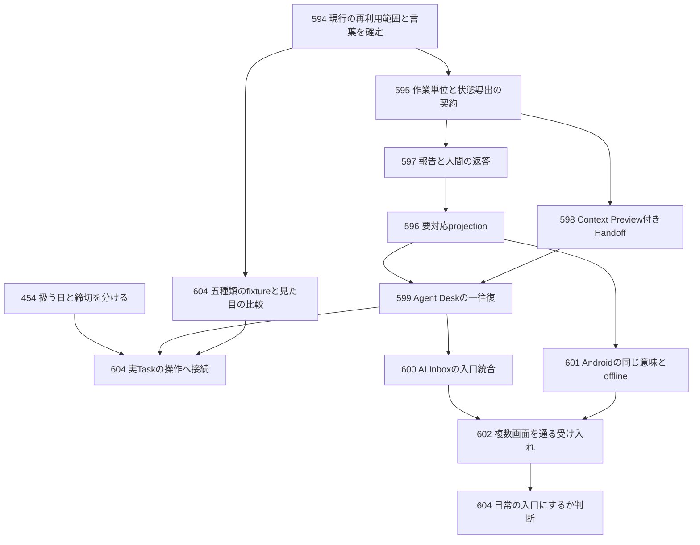

# TaskenのIssueから具体化する製品設計と実装計画

2026-09-20の設計提案。調査対象は `main@acc65ab1`、アプリ版は `0.1.65`。
GitHubのOpen Issue 14件を本文とコメントまで読み、関連する現行コード、設計文書、外部の一次資料と照合した。
本書は実装担当者へ渡す提案であり、既存仕様の変更、Issueの完了判定、実装着手の承認を意味しない。
アプリコード、実データ、GitHub Issueは変更していない。

最初に完成させる体験は、**AIから届いた質問に答え、成果を確認し、元のTaskへ戻れる一往復**とする。
Feedはその一往復を短く読める入口として試す。
Todayは人が実行する仕事を選ぶ場所として保ち、HabitとMaintenanceは別々の小さな実験にする。

見た目の設計見本は[画面構成図](./design/tasken-direction-2026-09-20.svg)を参照。
図は架空データによる静的な設計図であり、現行画面のスクリーンショットでも、操作可能なプロトタイプでもない。

## 計画を読む順序

| 担当する範囲 | 最初に読む箇所 |
| --- | --- |
| 全体の優先順位 | 「調査で分かった現在地」「着手順と引き渡す単位」 |
| Feedと見た目 | 「画面ごとの役割」「Feedの具体設計」「視覚仕様」 |
| Agent DeskとMCP | 「Agent Deskの具体設計」「共通契約と保存責務」 |
| Todayと生活用途 | 「Todayの具体設計」 |
| CalendarとSynology | それぞれの残作業の節 |
| 検証 | 「受け入れシナリオ」「実装担当者の完了条件」 |

## 調査で分かった現在地

Issue内の過去の現在地より、今回確認したコードと日付付き実機記録を優先する。
ただし、コードの存在と実環境での成功は区別する。

| 対象 | 確認した事実 | 計画への影響 |
| --- | --- | --- |
| AI協働 | Taskに `requester`、`intended_executor`、`executor_identity`、`work_state` がある。Work Receipt、Proposal、開始、受入れ、差戻しのCommandもある | 新しいAI専用Taskや全面的な状態管理を作らない |
| AI報告の表示 | `taskWorkInboxGroups` は報告をTask単位でまとめる。`taskWorkPeriods` は未採用Proposalと正式Receiptから作業の期間を投影する | 未採用報告を見せるために正式Receiptへ自動昇格させる必要はない |
| AI書き込み | `start_task_work` の明示開始は既存の限定的な直接Command。報告はProposalとして受領し、採用時に保存する | 「AIの書き込みを全部直接許可する」「開始にも新たな採用を要求する」の両方を避ける |
| 採用と完了 | 報告の採用だけではTaskを完了しない。UIには採用と完了の既存導線、契約には `AcceptTaskWork.complete_task` がある | 操作名と成功範囲を明確にし、既存境界を再利用する |
| DesktopのAI画面 | 実在するrouteは `ai-io`、表示名はすでに `AI Inbox`。`proposal-inbox` はalias | 架空の `/ai-inbox` を移行元として実装しない。既存routeの中身と表示を段階的に統合する |
| Android | `AiInboxSection` は作業中、確認待ち、停止中、最近完了を端末側で分類する | 同じ名前の画面をもう一つ作らず、共通read modelへ接続する |
| Todayの延期 | `TodayPage.handlePostpone` はScheduleの開始日と終了日を動かす | Feedの「あとで」に流用すると締切まで変わり得る。先に意味を分ける |
| Todayの抽出 | 共通selectorは明示Today、期限、期間などをpolicyで選ぶ。`today_date` を未来にするだけでは期限由来の表示が残る場合がある | 日付保存だけでなく、どの枠へ表示するかまで設計する |
| Calendar | Google adapter、OAuth endpoint、安全なtoken保存境界、接続用fixture testがすでにある | #273をadapter新設から始めない。実接続と日次表示の受け入れ確認へ絞る |
| NAS | 9月12日の記録には実Synologyへの配置、Desktop終了中のread-only MCP成功がある | #588のPhase 1と2を作り直さない。現在の稼働は今回未確認 |
| NAS外部接続 | 9月12日の記録ではTunnel経由の接続を外部要因で保留している | 現在も同じ障害と断定しない。再開時の再確認項目にする |
| 利用計測 | #453はClosedだが、本文には未実装とある。今回の限定検索ではusage event実装を確認できなかった | 完成済みの計測基盤があると仮定しない。最初の実験は手動の観察記録でも開始できる |

根拠となる実装と文書：

- [Taskの公開モデル](../src/shared/contracts/task/model.ts)、[TaskのCommand](../src/shared/contracts/task/commands.ts)、[Task Work Proposalとprojection](../src/shared/contracts/task/taskWorkProposal.ts)
- [AI Proposalの既存UI](../src/renderer/src/features/workspace/components/AiProposalPanel.tsx)、[route定義](../src/renderer/src/pages/routes.ts)、[Androidの画面と分類](../android-app/app/src/main/java/jp/personal/tasken/companion/MainActivity.kt)
- [Todayの操作](../src/renderer/src/features/workspace/pages/TodayPage.tsx)、[Today共通selector](../src/shared/todayTasks.mjs)、[再割当の制約](../src/main/modules/task/domain/taskAssignment.ts)
- [Calendar service](../src/main/services/calendarService.ts)、[Calendar adapter](../src/main/services/calendarAdapter.ts)、[Calendarの既存テスト](../tests/calendar-integration.test.mjs)
- [AI往復の既存契約](./ai-collaboration-e2e.md)、[Headless Core](./headless-core.md)、[NASの観測記録](../deploy/synology/DEPLOYED.md)、[現在地](./PLAN.md)

## 画面ごとの役割

### 推奨する責務

| 画面名 | 利用者が答えを得る問い | 主な操作 | 主役にしない情報 |
| --- | --- | --- | --- |
| Feed | 前回から何が変わり、今どこに反応するか | 開く、回答、成果確認、今日扱う | Task全件、毎回同じ期限警告、raw log |
| Today | 今日、自分が何を実行するか | 着手、完了、扱う日の変更 | AIの全進捗、接続管理、未整理入力の全件 |
| Agent Desk | 任せた仕事がどこまで進み、何を待っているか | 回答、成果確認、報告採用、委任内容確認 | token数、モデル比較、実行コンソール |
| ToDo / Theme | 仕事全体の内容、所属、日程をどう管理するか | 編集、分類、計画、検索 | Feed用の独自Taskコピー |
| Activity | いつ何が起き、どの記録を根拠に振り返るか | 日時から記録へ移動 | 現在の判断待ちの別管理 |
| Inbox | 残した入力をどう整理するか | Task化、Note化、整理 | Feedの既読処理 |
| Settings | 接続と保存の状態をどう管理するか | 接続、再接続、解除、診断 | 日常の成果確認 |

FeedとAgent Deskの判断操作は、同じ要対応項目と同じ詳細コンポーネントを開く。
Todayには必要なら「AIの対応待ち 2件」という入口だけを置く。
同じ質問カードをTodayにも丸ごと並べて、三重に処理させない。

### 名称とナビゲーション

提案する表示名は `Feed`、`Today`、`Agent Desk`。
Agent Deskの見出しは「対応待ち」「作業中」「開始待ち」「最近の結果」とする。
内部用語のNeeds You、Run、review_readyは通常画面へ出さない。
「最近の結果」にはTaskを完了しなかった受入れも含むため、「最近完了」と呼ばない。

実験中はFeedをexperimentalな任意入口とし、起動時の既定画面を変更しない。
Agent Deskの一往復が成立してから、現行 `ai-io` の表示と内容をAgent Deskへ統合する。
初回はroute IDを保持する案を推奨する。
`agent-desk` という新IDが必要になった場合のみ、`ai-io` と `proposal-inbox` のalias、選択Proposal ID、保存タブ、通知からの遷移を一緒に移す。
MCP設定はSettingsに置き、Taskに紐づかないNoteやArtifactのProposalもAgent Deskから引き続き確認できるようにする。

Feedを日常の既定画面にする判断は実験の後に行う。
採用時もToday、ToDo、Themeの入口は残す。
FeedとAgent Deskの両方に同じ数字のSidebar badgeを付けず、要対応件数のbadgeはAgent Deskに集約する。

## Feedの具体設計

対象：[Issue #604](https://github.com/mryk814/tasuken/issues/604)。

### 画面の一単位

一行は「一つの出来事、または一つの判断」を扱う。
Taskそのものの全項目を小さなカードへ圧縮しない。
通常行は次の順で読めるようにする。

```text
[出所のアイコン] Codex                         12分前   […]
                試験条件を選んでください       [回答待ち]
                粘度の評価を25℃と40℃のどちらで進めますか。
                高分子材料評価 › 粘度測定の条件を決める
                [回答する] [後で見る]
```

見出しを読めば必要な行動が分かり、出所、状態、対象Taskをその場で確認できる。
質問本文を省略する場合も見出しと主操作は残す。
タイトルと本文は文字選択でき、行全体を巨大なbuttonで囲わない。
詳細を開く領域と、回答などの操作領域を分ける。

### 最初の5種類のfixture

すべて架空の研究業務データを使う。
出所のラベルだけを差し替えた同じ文章を並べず、行動の違いを検証する。

| 種類 | 見出しと本文の例 | 常時表示する操作 | 詳細で確認するもの |
| --- | --- | --- | --- |
| 今日扱うTask | 「引張試験の結果を比較する」／今日扱う。締切は9月25日 | 「Taskを開く」「扱う日を変更」 | Task本文、チェック項目、着手と完了 |
| 停滞に関する提案 | 「比較条件を先に揃える案」／AI提案。3日間更新がないため表示 | 「提案を見る」「今回は見送る」 | 根拠となる更新時刻、提案範囲、採用前の差分 |
| 人間への質問 | 「測定温度を選んでください」／25℃か40℃かを確認したい | 「回答する」「後で見る」 | 選択肢、推奨理由、自由記述、関連Task |
| 成果確認 | 「比較表の作成報告が届きました」／3条件を比較。検証結果1件、未確認事項1件 | 「成果を確認」「Taskを開く」 | 成果、検証根拠、未確認事項、採用範囲 |
| 過去の文脈 | 「この条件を選んだ記録があります」／9月4日のNoteへの参照 | 「記録を開く」「今回は見送る」 | 元の記述、記録日、Taskとの関係 |

「3日間更新がない」は観測できる事実だが、「仕事が止まっている」は推測である。
AIによる提案には「AI提案」、過去の文章を要約した場合には「AI要約」を付け、原文へのリンクを残す。
通常のTaskや人が書いた過去の判断に、生成内容のラベルを付けない。
「過去の自分」という架空actorを増やすより、「自分の記録」と記録日を使う。

### 操作の意味

| 表示名 | 対象と結果 | 変えてはいけないもの |
| --- | --- | --- |
| 今日扱う | Taskの `today_date` を今日にする | 締切、実行主体 |
| 扱う日を変更 | Taskを扱う日を選ぶ | Scheduleの締切 |
| 後で見る | この質問や報告を再表示する日時を選ぶ | Taskの日程、質問の未解決状態 |
| 今回は見送る | 任意の提案や参考情報を今回のFeedから外す | Task、Note、Proposalの正式な採否 |
| 回答する | 特定の質問へ人間の返答を保存する | Task本文の全文、別の質問 |
| 提案を見る | 既存Proposal previewを開く | 開いただけでの正式データ更新 |
| 成果を確認 | ReceiptとProposalの詳細を開く | 開いただけでの採用やTask完了 |
| 完了にする | 人間がTaskの完了を明示する | 同じ見た目の「既読」への置換 |

初期Feedでは完了をすべての行に置かない。
Task行の詳細から既存の完了Commandへ到達できればよく、日付操作の誤解を減らしてから直接完了を追加する。
`Discuss` は汎用チャットへ置き換えず、fixtureでは「相談案を見る」までの範囲を明示する。
製品版では既存の外部AI依頼導線か、範囲を限定したProposal作成へ接続するまで、動かない「相談」ボタンを置かない。

### 並び順と終わり

初期タブは「今見る」「対応待ち」「最近の更新」の3つ。
「今見る」は以下の説明可能な順序にし、AIによる非公開スコアを導入しない。

1. 再表示時刻が到来した、または保留していない人間への質問と判断依頼。
2. 未処理の成果確認と変更Proposal。
3. 今日扱うTaskに関する新しい変化。
4. 任意の提案と関連記録。

同じ段階では人が設定した期限を優先し、次に受信の古いものを先にする。
AIの自己申告による緊急度だけで順位やTaskのpriorityを変えない。
「最近の更新」は受信した更新の新しい順にし、判断待ちの重要順と混ぜない。

初回は20行を表示し、続きは「次の20件を表示」で開く。
任意の提案と関連記録は初期値として一日合計5件までとし、要対応項目をこの上限で隠さない。
これは実験用の仮の上限であり、設定画面を先に増やす理由にしない。
同じTaskの通常progressは現在の作業単位ごとに最新要旨へまとめ、履歴は詳細へ残す。
閲覧中に新着を先頭挿入せず、固定したヘッダー領域に「新しい更新 2件」を出す。
人が反映するまで行の順序とスクロールの基点を動かさない。

末尾は「今確認する更新は以上です」とする。
後で見る項目があれば「後で見る 2件」を併記する。
情報を読んだだけで「すべて対応済み」と表示しない。
Feedを開くたびにAIが新しい文章を生成して、空白を埋めない。

### 件数と重複の規則

要対応件数は未解決の判断単位の数とする。
一つのTaskに独立した質問とNote変更案があれば2件であり、表示を一行へまとめても「対応 2件」と分かるようにする。
同じreportから生じたreview-readyとProposalは一つの判断としてまとめる。
異なる内容のProposalをTask IDが同じという理由だけで消さない。

「後で見る」は未解決件数を減らさない。
対応待ちタブで「今 3件／後で 2件」、badgeで合計5件を表示する。
既読、詳細を開いたこと、保留、回答済み、採用済みを別の意味として扱う。
通知は質問、判断依頼、成果確認の新規発生だけを候補とし、既定はアプリ内表示、同じ判断の再送で再通知しない。

### Feed実験の判定

同じfixtureから作る一覧形式とFeed形式で、順番を入れ替えて次の5問を試す。
「要回答のTaskを見つける」「締切を変えず明日へ回す」「AI提案を事実と見分ける」「成果を採用してTaskを未完了に保つ」「過去の判断を開いて元の位置へ戻る」。

重大な意味の誤りが0件、5操作を補助なしで完了し、一覧に比べ必要情報へ到達する時間が同等以下であることを入口の条件にする。
続く5日程度の利用では、重複して見た行、不要な提案、処理できなかった判断、Todayへ戻った理由だけを短く記録する。
統計的な優位の証明ではなく、本人の継続利用判断の材料とする。

| 判定 | 条件 | 次の扱い |
| --- | --- | --- |
| 日常の入口候補 | 誤解なく処理でき、一覧より読みやすく、ノイズが許容できる | 任意の既定画面候補にする。Todayは残す |
| 補助画面 | AIの判断待ちには有効だが、通常Taskは一覧が速い | Feedの対象をAIと関連更新へ絞る |
| 不採用 | 出所の混同、二度手間、重複が残る | Feed入口を撤去し、共通詳細と要対応projectionをAgent Deskへ残す |

## Agent Deskの具体設計

対象：[Epic #593](https://github.com/mryk814/tasuken/issues/593)、[#596](https://github.com/mryk814/tasuken/issues/596)、[#598](https://github.com/mryk814/tasuken/issues/598)、[#599](https://github.com/mryk814/tasuken/issues/599)、[#600](https://github.com/mryk814/tasuken/issues/600)。

### 一覧の骨格

4列Kanbanにはせず、一つの読める一覧に4つの見出しを置く。
対応待ちを先頭にし、他の見出しは折り畳める。
作業の本数だけを大きく示す指標カードは置かない。

```text
Agent Desk                                  絞り込み […]

対応待ち 3                         後で見る 1
  測定温度を選んでください    Codex    [回答する]
  比較表の成果確認            Codex    [成果を確認]
  評価Noteの変更案            外部AI   [変更を見る]

作業中 2
  試験結果の集計              Codex    最終報告 12分前
開始待ち 1
  粘度データの整理            外部AI   開始は未確認
最近の結果
  比較手順を確認              受入れ済み／Taskは継続
```

`working` は稼働監視ではなく、Taskenが開始を観測した作業状態である。
経過時間だけで成功、停止、失敗へ自動変更しない。
報告が古い場合は「最終報告 昨日14:20」と表示し、接続状態の診断は詳細へ置く。

### TaskからのHandoff

Task詳細の「AIへ任せる」から同じ右側スロットを使い、次の順で進める。

1. 対象Taskと任せる相手を確認する。初回は外部AIという一般指定も許し、モデル設定を要求しない。
2. 「期待する成果」と「追加指示」を任意入力する。元のTask本文はそのまま残す。
3. Context Previewで含める資料、理由、参照範囲、最終更新、切り詰めの有無を確認する。
4. 「AIへの依頼を準備」で既存delegate Commandを実行する。
5. 「依頼をコピー」から既存の外部AI依頼文を取り出せる。開始の報告を受けるまでは「開始待ち」。

Context Previewとコピーする依頼は同じ対象、同じ参照版を指す。
プレビュー後に対象や関連資料が更新された場合は、変更点を示して再確認する。
一覧やContextを読んだだけで「AIが取得済み」と保存しない。
依頼の準備は外部AIの自動起動を意味しないため、画面に「外部AIへ依頼文を渡すと開始できます」と結果に必要な一行を置く。

### 回答

詳細の上半分に質問、選択肢、必要な根拠を置き、下に返答欄を置く。
選択肢がある場合も自由記述を許す。
AIの推奨案は「推奨」と理由を示すが、送信済みの回答として扱わない。
ボタンは「回答を送る」。保存後は「回答済み／再開待ち」とし、agentから開始または再開の報告が来るまで作業中にしない。

回答は質問IDと作業単位IDへ紐づく。
別の質問への誤送信、他端末ですでに回答された質問への上書きを防ぎ、競合時も入力を保持する。
詳細を閉じる操作は下書き保存であり、回答の送信やProposal採用を自動実行しない。
Task編集の自動保存と、未送信の判断入力を混同しない。

### 成果確認と採用

詳細の読み順は「成果」「確認できたこと」「未確認事項」「Taskenへ反映する内容」。
ファイル名、テスト名、実行結果は必要な範囲で示し、「tests passed」の一語だけで全体が検証済みと見せない。
コード差分を専門的に確認する場合は既存の外部成果リンクへ移動し、TaskenにIDEを新設しない。

| 操作名 | 保存される結果 |
| --- | --- |
| 報告を採用 | 報告を正式Receiptへ保存する。Taskは継続 |
| 採用してTaskを完了 | 採用範囲を保存し、人が明示したTask完了を実行する |
| 修正を依頼 | 修正内容を残し、対象の作業を差戻す。Taskは継続 |
| この変更案を却下 | Proposalを不採用にする。修正依頼の送信とは別 |

確認詳細では「報告を採用」を既定の主操作にし、「Taskも完了する」は選択されていない明示オプションにする。
チェック項目を変更するProposalなら、反映される項目もプレビューに含める。
既存の採用と完了が二つのCommandで構成される経路では、前半だけ成功した場合に「報告は採用済み。Task完了は再試行できます」と示す。
全体を失敗扱いして報告を二重保存しない。

### 取消と再割当

現行コードは作業中と確認中の安易な再割当を拒否している。
初期UIではこの制約を維持し、実行中の相手をラベル変更だけで差し替えない。
#602の再割当シナリオへ進む時点で、委任解除と新しい作業単位の作成を明示Commandにする。
Task IDと人間の責任は維持し、旧作業の報告は履歴として読めるようにする。
外部AIのプロセスを制御しないため、「AIを停止」ではなく「委任を解除」と表示し、外部での実行停止は保証しないことを操作時に伝える。

## 共通契約と保存責務

対象：[#594](https://github.com/mryk814/tasuken/issues/594)、[#595](https://github.com/mryk814/tasuken/issues/595)、[#597](https://github.com/mryk814/tasuken/issues/597)。

### 既存データから導出するもの

| 概念 | 正本または導出元 | 提案する扱い |
| --- | --- | --- |
| Task | 既存TaskとSchedule | 全画面で同じIDを参照 |
| 人間の責任 | 単一利用者のworkspaceという製品前提 | UIでは「自分」。多人数owner管理を増やさない |
| 依頼の出所 | Taskの `requester` | `ai_agent` や `external` もあり、human ownerとは同一視しない |
| 現在の実行担当 | `intended_executor` と `executor_identity` | provider名やmodel名とは分離 |
| agentのセッション | 既存AgentSessionと `source_session` | 一つのセッションが複数Taskを扱う可能性を保つ |
| AIの報告 | pendingなTask Work Proposal | 「届いた報告」という事実。正式採用とは別 |
| 採用した作業記録 | WorkReceipt | 成果、検証、来歴の保存先 |
| 要対応 | 未解決の質問、レビュー、Proposalから導出 | Inboxという別のTask DBを持たない |
| FeedItem | 上記とTask更新、関連記録から導出 | 再生成可能。独立した正式Taskや本文を保存しない |

`requester = self` を人間ownerの必須条件にすると、AI起点で作られたTaskが責任不明になる。
一人用アプリでは責任を利用者へ保ち、起案者の来歴を別に残すことで足りる。

### 画面へ渡すread model

`AttentionItem` は一つの未解決判断、`FeedItem` は一つの表示行を表す。
共通化するのは判断の識別と操作の意味であり、Habitの実施記録まで同じ巨大な型へ統合しない。

| 要素 | 必須の情報と制約 |
| --- | --- |
| AttentionItemの識別 | `attentionId`、`kind`、`sourceRef`、`sourceVersion`。TaskなしのProposalを扱うため `taskId` は任意 |
| 作業との関係 | `workAttemptId`、`requestId`、agentの識別と表示名。対象が存在しない場合は不明として返す |
| 表示する内容 | 見出し、短い要旨、求める判断、受信時刻。AI生成文かどうかは明示した属性で返す |
| 鮮度 | データの取得時刻、取得元、`fresh / stale / unknown`。未取得と成功した0件を区別 |
| 操作 | `availableActions` に型付きaction ID、対象、実行可否、実行できない理由。UIは文言からCommandを選ばない |
| FeedItem | 安定した `itemId`、source参照、必要なら `attentionIds`、出所、表示理由、要旨、発生と受信の時刻。判断の正本はAttentionItem側を参照 |
| 再表示の識別 | source IDと意味上の更新版を使う。同じ内容の再送や経過時刻の変化だけで新しい行を作らない |

回答と採用のCommandは、選択時のsource参照とversionを必ず受け取る。
画面から届いた要旨やラベルを信用して対象を更新せず、Mainで正本を再読込する。
一覧が更新されても編集中の対象を黙って切り替えない。
同順位の行には安定したIDで最後の順序を付け、再描画のたびに行が入れ替わらないようにする。

### 不足を補う最小の識別情報

新しい `AgentRun` テーブルの作成は初手にしない。
一方、現在の `source_session` や開始時刻だけでは、同じセッション内の再依頼と旧報告の遅着を安全に区別できない。
次の追加案を#595で固定し、必要な箇所だけversioned contractへ加える。

- **作業単位ID**：Taskへの一回の委任を識別するUUID。Handoff、再割当、明示的な再依頼で更新し、Taskの現在参照と履歴、報告に持たせる。
- **質問ID**：一回の回答または判断を識別するID。質問の再送で変えない。
- **報告順序**：作業単位内の順番。発信時刻 `reported_at` と受信時刻を別に保持し、発信側の時計だけでcurrent stateを選ばない。
- **操作の冪等キー**：同じ要求の再送は同じ結果を返す。キーが同じで内容が異なれば競合にする。

Taskのversionは通常編集でも変わるため、作業単位IDの代用品にしない。
古いクライアントのIDなし報告は今までどおり履歴とProposalで読めるようにし、再割当後のcurrent状態を確定する証拠には使わない。
旧報告を新しい作業単位へ日時の近さだけで紐付けない。

### 状態の導出表

以下の表示状態はread modelであり、この名前をすべてTaskの新enumとして保存する提案ではない。

| 条件 | 表示 | 要対応 | Taskの完了 |
| --- | --- | --- | --- |
| 委任済み、開始未観測 | 開始待ち | なし | 変更しない |
| 現在の作業単位の開始が保存済み | 作業中 | なし | 変更しない |
| 未解決の入力要求が届いた | 回答待ち | 質問1件 | 変更しない |
| 未解決の選択や許可要求が届いた | 判断待ち | 判断1件 | 変更しない |
| 返答の保存が成功、再開未観測 | 回答済み／再開待ち | 対象の質問は除外 | 変更しない |
| 現在の作業単位の成果報告が届いた | 成果確認待ち | 報告に紐づく判断1件 | 変更しない |
| 人が報告を採用、Task完了は未選択 | 受入れ済み／Taskは継続 | 解決した判断を除外 | 変更しない |
| 人が採用とTask完了を明示 | 受入れ済み／Task完了 | 解決した判断を除外 | 完了 |
| 人が修正内容を保存 | 修正依頼済み／再開待ち | 対象レビューは解決 | 変更しない |
| 別作業単位からの遅い報告 | 過去の作業報告 | currentの判断を復活させない | 変更しない |
| sourceを取得できない | 更新を確認できません | 最後の確定状態を保持 | 変更しない |

未採用のblocked報告を見せるためにTaskの正式 `work_state` を先に書き換えない。
projectionには表示状態と根拠のProposal/Receipt IDを返し、Task自身の状態と区別する。
同じ作業単位で未解決質問がある間は、単なるprogress再送で回答待ちを消さない。
質問の解決、取下げ、差戻し、再依頼は対象IDを伴う操作で行う。

### 人間の返答と「後で見る」の保存先

人間の返答は既存WorkReceiptを再利用する案を推奨する。
人間actorによる返答種別と質問参照を型付けし、回答本文、選択肢ID、作業単位IDをappend-onlyに残す。
汎用の `runtime_metadata` の自由なJSONだけを返答の正本にしない。
`ReplyToAgentRequest` 相当の狭い人間用Commandを設け、質問が現在も有効かを保存時に確認する。
MCPの `get_task_context` は未受領の返答とそのIDを返し、agentが次回queryで再取得できるようにする。
既存Receipt表示では人の返答とAIの成果報告を区別する。

既読、任意情報の見送り、再表示日時はTaskの状態ではなく利用者の表示上の選択である。
fixtureではメモリ内だけに置く。
製品接続時には同期可能な既存設定の保存責務を確認し、適合するものがなければsource参照と再表示日時だけを持つ小さな `AttentionDisposition` を追加する。
これはFeed本文や要対応状態の複製ではない。
DesktopとAndroidで保留を共有する要件を受け持ち、元Proposalのpending状態は変更しない。
後で見る操作をTaskの `today_date` へ保存しない。

### 実装を置く境界

| 境界 | 責務 |
| --- | --- |
| shared contract | 要対応の種類、source locator、操作可能条件、返答と作業単位のschema |
| MainのTask/Proposal application層 | 状態の導出、source version照合、冪等処理、返答、採用と差戻し |
| Repository | 現在参照と履歴を同一transactionへ保存。必要なmigrationとExport対応 |
| MCP | 既存append/report toolを中心に不足分だけ型付き拡張。許可範囲は維持 |
| Desktop storeとUI | read modelを表示し、型で指定されたCommandへ接続。日本語文言から挙動を判定しない |
| Mobile Gateway | Desktopと同じ意味のJSON read modelを返す |
| Android | DTOとキャッシュを表示。独自の状態導出を増やさず、共有golden fixtureで意味を合わせる |

KotlinからTypeScriptを直接参照する前提にしない。
状態導出をMainに置き、Androidはその結果をキャッシュする。
offlineで未送信の操作状態だけを端末側へ重ね、正式状態とは区別する。

## Todayの具体設計

対象：[Issue #454](https://github.com/mryk814/tasuken/issues/454)。

### まず日付操作を明確にする

同じ「あとで」という語で三つの保存先を動かさない。
Taskには「扱う日を変更」、期限には「締切を変更」、Feedの質問には「後で見る」を使う。

Taskの扱う日メニューは「今日」「明日」「来週」「日付を選ぶ」「今日の選択を外す」。
「来週」は実際の日付を併記する。
この操作では `today_date` のみを変え、Scheduleのdeadlineや実施期間は維持する。
保存後は「明日扱います。締切は9月19日のままです」のように、期限が関係する場合だけ短く説明し、Undoを用意する。

未来に回した期限超過Taskは、今日の実行一覧から外すが存在を隠さない。
「期限の確認」に「締切 9月19日／明日扱う」と残す。
今日が期限のTaskも同じ規則で、今日扱うと明示していなければ期限の確認へ置く。
同じTaskを同一画面の複数枠に丸ごと重複表示せず、実行一覧にある場合は期限chipへ集約する。

```text
Today                                    [追加]
9月20日（日）

今日やること
  引張試験の結果を比較する    締切 9/25    [着手] […]
  比較グラフをNoteへ残す                    [完了] […]

次の予定   15:00–15:30 設計レビュー

期限の確認 1
  評価条件の回答              締切 9/19／明日扱う

続けること                  今週 1/3回
手入れの目安                フィルター清掃／9/25ごろ
未整理の記録 3件を整理する
```

Habit、Maintenance、Calendarの各領域は、対象データが存在する場合だけ現れる。
HabitとMaintenanceをまだ使っていない人のTodayに、空の設定案内を常設しない。

### Captureの扱い

追加の既存入口を保ち、タイトルだけのTaskと、未整理の記録を素早く残せるようにする。
内部のTask/Capture区別を利用者へ毎回選ばせるUIは、現在のapp charterと合わないため追加しない。
Todayには未整理件数から既存Inboxへ開く入口を置けばよい。
未整理の件数を0にすることを、仕事が進んだことの代替指標にしない。
Stickyは整理状態と独立した表示方法として保ち、今回統合しない。

### Habitの最小実験

最初は手動記録だけにし、「毎日1回」と「週N回」を対象にする。
例は「読書」「運動」で、主表示は「今日1回」「今週2/3回」。
連続日数、大きな達成率、失敗を強調する赤い表示は置かない。
週の区切りは利用者のタイムゾーンで月曜開始とし、仕様として明示する。

主操作は「1回記録」。
記録後は実施時刻とUndoを表示し、同じ日の追加は「もう1回記録」から明示的に行う。
連打と通信再送は同じ記録を増やさず、意図した2回目は別の記録とする。
実施日の修正を履歴から可能にし、目標変更で過去の実績を書き換えない。

実装時にHabit本体と実施記録を保存し、日付ごとのTaskを自動生成しない。
一時停止、再開、実施取消、過去記録の表示、削除とUndo、Export/Importまでを一つのsliceに含める。
2週間程度で「自然に記録できるか」「Recurring Taskより意味が合うか」を判断する。
Widgetはこの価値を確認した後に選ぶ。

### Maintenanceの最小実験

最初は「対象」「すること」「前回実施日」「次の目安」を扱う。
例は「エアコン／フィルターを掃除する／8月25日に実施／9月25日ごろ」。
推奨間隔による目安と、必ず守る締切は区別し、目安超過をTaskの期限違反として数えない。
厳密な契約期限を守る必要がある仕事は、引き続きTaskのdeadlineで扱う。

主操作は「実施を記録」。
実施日と短いメモ、次の目安を確認し、次の目安は今回の実施日から既定間隔で提案する。
利用者が日付を指定した場合はその値を保存する。
Undoでは直前の実施記録と次の目安の両方を戻す。
前回不明の項目を勝手に「期限超過」へ分類せず、「次の目安を決める」から始める。

Todayには目安が近い項目だけを小さく出し、過去の未実施回数を積み上げない。
管理と履歴は詳細へ置き、独立した大きなTop Level画面は必要性を確認してから判断する。
評価期間は少なくとも一回の手入れ周期を含め、利用回数の少なさだけで廃止しない。
外部Signalによる自動実施判定は、この手動モデルが成立した後の別実験とする。

## 視覚仕様

既存の[デザインガイド](../design-standard/design-guide.md)と[トークン](../design-standard/tokens.css)を継承する。
研究業務の文章を落ち着いて読める密度と、判断の根拠へ戻れることをTaskenの特徴にする。
Xからは短い読み幅、出所と時刻、行区切り、軽い深掘りを借りる。
SNSの青、巨大なavatar、反応数、人物の人格化は持ち込まない。

| 項目 | 推奨仕様 |
| --- | --- |
| 基本色 | 現在の実値は背景 `#ECE2DF`、面 `#FFFFFF`、本文 `#26201E`、枠 `#DCC1C4`、主操作 `#8A2F3B`。実装では対応tokenを参照 |
| 文字 | `--font-base` のNunitoとNoto Sans JP。本文14px、補足13px、節見出し16px、ページ見出し20pxを基準にする |
| 数字 | 日時や件数はtabular-nums。コード等のみ `--font-mono` |
| 行の密度 | 本文は通常2〜3行、出所と時刻1行、対象1行、操作1行。上下12〜16pxを基準にし、固定高で文章を切らない |
| 操作数 | 常時表示は主要1つと補助1つ、その他メニュー。行のbuttonは最大4個という既存上限を守る |
| 形 | Feedは白い連続面と横罫線。各行を丸い箱に分けない。フォームは7px、詳細の面は10pxの既存radius |
| AIの区別 | AI起点の操作は既存 `--action-ai-*`、生成文には文字ラベル。事実か提案かを色だけで判定させない |
| 状態 | 作業中はactive、回答待ちはblocked、成果確認はreview、受入れ済みはdone。Taskの状態名とは別のラベルを併記 |
| 主操作 | 開いている返答または確認フォームの主操作だけをburgundyの塗りにする。Feed全行へ強い塗りのボタンを並べない |
| 選択とfocus | 選択は淡い背景とアクセントバー。focusは別に `--focus-ring` で示す |
| 動き | 新着の挿入、点滅、読み上げを連続発生させない。押下反応と状態更新に限定し、reduced motionを尊重 |

補足色で表示するsourceや時刻も、判断に必要な文章として読めるコントラストを確認する。
必要な本文を薄いtertiary色へ落とさない。
ダークモードは同じtokenのdark値へ切り替え、別の色体系を作らない。

### 対応幅と詳細領域

[既存の幅契約](./responsive-layout.md)を優先する。
特に実効幅1680px以下で右Context Paneを常設しない現行方針を守り、Feedだからという理由で1280pxへ3列を押し込まない。

| 幅の目安 | 構成 |
| --- | --- |
| 実効1680px超 | 既存Sidebar、640〜720pxのFeed、右詳細1スロット。中央本文を画面幅いっぱいに伸ばさない |
| 980〜1680px | 既存SidebarとFeed。詳細は右から重ね、中央の幅とスクロールを変えない |
| 980pxかつ本文倍率1.3 | 実効約754pxまでを確認し、操作を折り返す。文字を縮めて帳尻を合わせない |
| Androidの狭幅 | 1列一覧から詳細へpush。戻ると同じ項目とスクロール位置に戻る |
| Foldの展開時 | 一覧と詳細の2pane。ヒンジ、実際のpane幅、IMEを見て切り替える |

右詳細からProposalやContextを開く場合は同じスロット内で内容を切り替え、Drawerを重ねない。
元のTaskと起点をbreadcrumbまたは戻る操作で保つ。
未選択時の右側は静かな空間とし、全体指標やおすすめで埋めない。

Feedは通常のリスト、行ごとの見出し、`time`、`button`、リンクで構成する。
初期段階で複雑なARIA feedや独自のキーボード操作体系を追加しない。
新着や処理結果だけを短く通知し、行本文の全体をlive regionにしない。

### Androidの操作位置

対象：[#601](https://github.com/mryk814/tasuken/issues/601)。

上部は見出しと状態、中央は質問と成果、下部は回答欄と主操作に使う。
主操作は右手で届く位置へ置き、[本人の操作範囲](./android-thumb-reach.md)を基準にする。
下端に置いたことだけで押しやすいと判断せず、IMEとgesture insetを含めた画面で確認する。
既存の追加と音声入力の入口を維持し、Feed専用composerを増やさない。

スワイプは初期必須にせず、すべての操作を可視buttonかメニューでも実行できるようにする。
採用、Task完了、削除をスワイプの即時動作へ割り当てない。
狭幅で2〜3件の行が読める密度を目安にするが、タップ領域44dp以上と長い日本語の可読性を優先する。

## Calendarの残作業

対象：[Issue #273](https://github.com/mryk814/tasuken/issues/273)。

最新のIssue冒頭に従い、今回の完了対象はGoogle Calendar。
古い本文とコメントのMicrosoft優先案は今回の順序に採用しない。
GoogleのadapterとOAuth処理は存在するため、まず実接続の未検証箇所を確定する。

Todayは「次の予定」と必要時の当日一覧、Activityは同じread modelを使った日次時間軸とする。
予定がない時間は空白のままにし、「観測なし」の行を作らない。
外部予定には時刻とカレンダー名を示し、Task用の完了checkboxを付けない。
終日予定は時刻軸の上の専用行に置き、架空の13:00開始などを作らない。

Settingsの接続領域は「Googleアカウントで接続」「接続中のアカウント」「最終更新」「更新」「接続解除」で完結させる。
初期実装は既存のprimary calendarを対象とし、複数カレンダー選択を足すなら別の小さなsliceにする。
アカウント設定が未完の状態と認証期限切れを分け、通常画面へclient IDなどの実装用語を出さない。
権限は既存の読み取り目的を維持し、不要なscopeの削減余地は実接続確認と一緒に確認する。

| 状態 | 見せ方 |
| --- | --- |
| 当日の取得成功で0件 | カレンダー領域内に「予定はありません」 |
| 更新中 | キャッシュを保持し、更新操作に進行状態を表示 |
| offlineでキャッシュあり | 既存予定と「最終更新 14:20／更新できません」を表示 |
| 接続したが取得成功履歴なし | 「予定を取得できません」。0件とは表示しない |
| 認証失効 | 「再接続」で復帰できる。Taskの一覧は残す |

閉じる条件は、実Google OAuth、再起動後のtoken利用、手動更新、終日と日付跨ぎ、繰返しの重複防止、期限切れとoffline、接続解除、TodayとActivityの一致を確認できること。
実アカウントへの接続は後続の実施時に、対象と許可範囲を確認して行う。
Feedの時間衝突提案はCalendarの鮮度が確認できるようになってから追加し、自動再配置は含めない。

## Synologyの残作業

対象：[Issue #588](https://github.com/mryk814/tasuken/issues/588)。

このIssueは製品UIの主軸と独立した運用の計画として進める。
Agent Deskの最初の一往復はDesktopのCoreとMCPで成立させ、NASの外部接続待ちで止めない。
既存NASがread-onlyである限り、PC停止中に質問へ回答したりProposalを採用できるとは約束しない。

| 順序 | 完成させるもの | 判断条件 |
| --- | --- | --- |
| N1 | 配置済み版、replica鮮度、読み取り制限、バックアップの現在地 | 9月12日の記録を現時点の成功として流用しない |
| N2 | 外部MCP clientからのread-only接続 | 元のTunnel保留が現在も再現するか確認。未成立ならtransportだけを再検討 |
| N3 | Desktop停止、NAS再起動、transport再接続からの復帰 | 同じworkspaceとdeviceで読め、通常のDesktop利用も継続できる |
| N4 | 書き込みの可否を決める設計審査 | Core側のwrite gate、同時変更、revoke、旧schema、添付未到着を説明できる |
| N5 | 許可された狭いwriteを追加 | まずProposal受領などに限定。Task直接編集やmulti-writer全面移行へ広げない |

Settingsに出す情報は「NASへ反映済みの時刻」「AIから参照可能か」「読み取り専用か」「復旧に必要な操作」。
通常画面へコンテナ名、port、全capability一覧を並べない。
MCPの応答も取得元と鮮度を表現し、最新のDesktopデータか不明なときは最新と断定しない。
添付未到着は本文が読めることと分けて伝える。

ライブSQLiteを共有しない境界、replicaとbackupの分離、NAS停止中のDesktopとAndroidのlocal利用を維持する。
relayの選定はN4以降の別判断とし、この計画では新しい同期基盤の採用を決めない。

## 外部事例から採用する要素

確認日：2026-09-20。
以下は公開文書からの確認であり、各製品へのログインや現在の実画面の横並び検証は行っていない。
「Taskenへの翻訳」は今回の設計判断である。

| 一次資料 | 確認した要素 | Taskenへの翻訳 |
| --- | --- | --- |
| [Xのtimeline](https://help.x.com/en/using-x/x-timeline) | 推薦とFollowingの切替、本文から詳細へ進む操作 | 「今見る」と時系列を分ける。人気や反応数による順位は採用しない |
| [Ambra](https://ambra.app/) | 一つの入力欄、Taskの時系列表示、本文近傍のtagと担当情報 | 軽い入力と行内metadataを借りる。tagを正式なTask状態にしない |
| [Linear Pulse](https://linear.app/docs/pulse) | work updateのFeed、For meとRecent、個人の絞り込み | 自分に関係する更新と全履歴を分ける。Popularは導入しない |
| [Asana Inbox](https://asana.com/features/project-management/inbox) | Inboxで返答やfollow-upを扱い、My tasksは別に持つ | Feedと実行一覧の責務を分け、詳細を開く前後の手間を減らす |
| [Wrike Activity](https://help.wrike.com/hc/en-us/articles/28554637095703-Activity-in-Wrike-for-iOS) | mobileの更新一覧、返信、不要な更新の除外 | 携帯時の短い返答を重視。開いただけで既読になる挙動を判断完了へ転用しない |
| [Universal Inbox](https://doc.universal-inbox.com/quick_start/inbox_screen) | sourceとtype、右preview、snooze、既存Taskへの関連付け | 更新とTaskのIDを分け、「後で見る」とTask操作を分ける |
| [Linear Agents](https://linear.app/docs/agents-in-linear) | human assigneeを保ったagentへのdelegation | 起案者、責任、実行担当を区別。個人アプリに組織管理は持ち込まない |
| [JiraのAI agents](https://support.atlassian.com/jira-software-cloud/docs/collaborate-on-work-items-with-ai-agents/) | work item内でagentの出力を人が確認する | 元Taskの詳細へ成果を戻す |
| [GitHub Agents](https://github.com/features/copilot/agents) | work itemとContextを渡し、後から成果やPRを確認する | Handoffと成果リンクをTaskへ接続。Tasken自身にcoding runtimeは置かない |
| [AppHandoff](https://apphandoff.com/docs/) | MCPを介した共有Context、contract、ticket | typedな依頼内容と作業単位を採用。ホスト型の開発管理基盤全体は導入しない |
| [Tokanban](https://app.tokanban.com/agents) | Taskと状態をMCP、CLI、RESTから扱う | 同じ仕事をUIとagentが参照する境界を採用。別のTask正本は作らない |
| [Agent Bridgeの一例](https://github.com/xyva-yuangui/agent-bridge) | ローカルの共有Task boardとMCP/CLI | 共有状態の考え方だけを比較する。IssueのAgentBridgeはURL未指定で同名製品が複数あり、同一対象とは断定しない |

AsanaのHelp Center本文は取得時にCSS Errorとなったため、上表は公式の機能説明を根拠にした。
Compactの正確な密度やAndroidの長押し操作は未確認。
Asana AI Teammatesの[公式紹介](https://asana.com/product/ai/ai-teammates)も参照したが、詳細な状態遷移や保存契約の根拠には使っていない。
#594を完了にする前には、比較対象のAgentBridgeのURLを固定し、#604が求める6系統の画面比較で、行の構造、操作数、返信、保留、既読、終端表示を実際の画像から確認する。
現時点の設計を実画面調査済みとして扱わない。

## 着手順と引き渡す単位

日数の見積もりは置かず、完成させる動作と依存で区切る。
Feedのfixture試作をAgent Deskの全実装が終わるまで待たせず、保存を伴う本接続は契約の確定後にする。



| 単位 | 対象Issue | 実装担当者へ渡す完成像 | 次へ進む条件 |
| --- | --- | --- | --- |
| A | #594 | 本書の現状表を出発点に、用語、再利用、比較画像、未確認箇所を確定 | 実在routeと保存境界が分かり、同じ概念へ複数名を付けていない |
| B | #595 | source一覧、状態導出、作業単位ID、旧データ読み取り、共有fixture | 遅い旧報告と再割当を1Taskのまま表現できる |
| C | #604の前半 | 5種類、広幅と狭幅、質問とレビューの設計prototype | 5操作の意味の誤り0件。正式データの保存は不要 |
| D | #454の最初のslice | Taskの扱う日、締切、Feedの再表示日の分離とUndo | 締切不変、期限の確認枠、日付跨ぎ、再起動が確認できる |
| E | #597 | 既存報告toolの型付き拡張と、人間の返答を再取得できる経路 | 再送、順不同、旧作業からの報告を扱える |
| F | #596 | 未解決質問、成果、変更案の共通projection | 判断単位の件数が一致し、二重表示や偽の解決がない |
| G | #598 | 任せる相手と期待成果、同じContext Preview、開始待ちへの遷移 | コピーとPreviewが同じ参照を指し、開始を偽装しない |
| H | #599 | 質問の回答から成果確認までを4見出しの一覧で実行 | 既存Proposal previewとTask詳細へ往復できる |
| I | #600 | AI InboxをAgent Deskへ統合し、旧リンクを維持 | TaskなしProposalを含む全種類と履歴へ到達できる |
| J | #601 | cached要対応、短い返答、online review、Foldの詳細 | 未送信と正式成功を区別し、Desktopと収束する |
| K | #602 | 一つのTaskをDesktop、MCP、Androidで往復させる受け入れ証跡 | 下のシナリオが通り、残った実機境界が明記される |
| L | #604の後半 | 実Taskと要対応をFeedへ接続し、利用後に採否を決める | Agent Deskなしの別状態管理が増えていない |
| M | #273 | Googleの実接続と同じ日次read modelの表示 | 実アカウント、失効、再接続、解除の証跡 |
| N | #588 | 既存NASのread-only運用と外部接続の残り | N1〜N3の証跡。writeは別の判断 |
| O | #454の後半 | Habit、次にMaintenanceを一つずつ試す | 各々の記録、取消、履歴、Export、実利用評価 |

#593は親Epicとして、この一往復と子Issueの成果をまとめる。
子Issueと同じ実装を持つ別の巨大PRにはしない。
#602のシナリオとfixtureはBから設計を始め、最後にまとめて仕様の矛盾を発見する進め方を避ける。
#273と#588はAI往復の初期実装の必須依存にしない。

## 受け入れシナリオ

対象：[#602](https://github.com/mryk814/tasuken/issues/602)を中心に各Issueの受け入れ条件を具体化する。
既存の成功テストを根拠なく書き直さず、不足する境界を追加する。

| 場面 | 操作と期待結果 |
| --- | --- |
| 基本の一往復 | Task作成→Handoff→MCP開始→質問→Android回答→MCP再取得→再開→成果報告→Desktop採用→明示完了。同じTask ID |
| 報告だけ採用 | Receiptが保存され、Taskが未完了のまま。最近の結果に「Taskは継続」 |
| 採用して完了の部分成功 | 採用成功後の完了失敗を区別し、完了だけを再試行。Receiptを二重作成しない |
| 差戻し | 修正理由を保存し、agentが取得。新しい成果が来るまで未完了 |
| 再割当 | Agent Aの委任を終えてBへ渡す。Aの遅いdoneでBの状態やTaskを巻き戻さない |
| 再送 | 報告、返答、Handoff、採用の応答を失って再送。同じ記録と結果を返す |
| 順不同 | reportの到着順と発信時刻を入れ替える。currentの選択が端末ごとに変わらない |
| 質問とprogress | 未解決質問の後にprogressが届いても、回答待ちが消えない |
| 複数の判断 | 同じTaskに質問と独立したNote変更案。合計2件。一方の処理で他方が消えない |
| 同じ報告の重複 | review-readyとその報告Proposalは1判断。採用後に二つ目が残らない |
| TaskなしProposal | Note作成やArtifactの提案が既存previewで確認でき、ナビ統合で消えない |
| offline返信 | 下書きと未送信表示を保持。online復帰後の保存成功で初めて質問を解決 |
| offline承認 | 成果確認は読めるが、古い版への採用は成功扱いしない。再接続と再確認へ進む |
| 端末間競合 | Desktopで処理した質問へAndroidの古い返信を送る。入力を残し、競合を示す |
| 締切超過Taskの延期 | 明日扱うへ変更。締切は不変。今日の実行枠から移り、期限の確認で発見できる |
| 再表示の延期 | 質問を後で見るへ変更。Taskの日付は不変、未解決件数も不変 |
| Habitの二重入力 | 連打と再送で1記録。明示的な「もう1回」は別記録。Undoと実施日修正が可能 |
| Maintenanceの取消 | 実施記録と次の目安を同時に戻す。前回不明を期限超過にしない |
| source削除と復元 | 開いているTaskやNoteが削除されてもクラッシュしない。元へ戻る導線と復元後の参照が保たれる |
| 読込中 | 行の骨格を保ち、確定していない0件badgeを表示しない |
| 空と絞り込み0件 | 「対応待ちはありません」と「条件に一致しません」を区別。後者は解除へ進める |
| 取得と保存の失敗 | 前回データと入力を保持し、原因と再試行を該当箇所へ残す |
| 閲覧中の新着 | 新着の反映前に一覧が動かず、詳細から戻ると同じTaskと位置を復元 |
| 狭幅と倍率 | 980×680、本文倍率1.3、1280×800、1536×960、広幅、Android狭幅、Foldを確認 |
| 長い文章 | 長い日本語タイトル、Theme名、URL、複数段落の質問、100件以上の要対応でも操作が押し出されない |
| キーボード | Tabで到達、Enterで詳細、Escapeで下書きを保って戻る。textareaのEnterは改行。閉じると起点focusへ戻る |
| 読み上げ | 出所、状態、見出し、主操作を順に把握できる。新着全件を自動で読み上げない |
| Calendar障害 | offlineを予定0件と見せず、Taskは使える。終日、日付跨ぎ、繰返しはTodayとActivityで一致 |
| NAS不在 | DesktopとAndroidのlocal機能が続く。NASの古いContextを最新と見せない |

## 実装担当者の完了条件

実装時は、関係する既存チェックから始める。
次は実在する入口の例であり、今回実行したテストの報告ではない。

| 変更境界 | 既存の確認入口 |
| --- | --- |
| Task Workと採用 | `tests/task-work-receipts.test.mjs`、`tests/task-work-history.test.mjs`、`tests/ai-collaboration-e2e.test.mjs` |
| Proposal UIと保存 | `tests/ai-proposal-operation-boundary.test.mjs`、`tests/ai-proposal-acceptance-path.test.mjs`、`smoke:proposal-live` |
| 委任とAndroid | `tests/mobile-gateway-agent-delegation.test.mjs`、AndroidのAI Inbox、WorkReceiptの既存testとgolden fixture |
| 日付とToday | `tests/today-ia.test.mjs` と共通Task/Scheduleの関連テスト |
| Calendar | `tests/calendar-integration.test.mjs`、`tests/activity-calendar-panel.test.mjs` |
| NAS | `tests/tasken-headless-core.test.mjs` と配置先でのread-only復帰確認 |

Nodeの関連テストは `rtk node scripts/run-electron-node.mjs --test tests/<対象>.test.mjs`、TypeScript変更は `rtk npm run typecheck`、画面とビルド経路は `rtk npm run build` を使う。
merge前には `rtk npm run ci` を通す。
画面変更は隔離userDataと現実的なfixtureを使い、影響する状態を目視する。
Desktopでは所定のplaywright-interactiveによる対象アプリ確認、AndroidではS23とFoldの対象状態を確認する。
スクリーンショットだけでfocus、操作、永続化、実機接続を確認済みにしない。

新しい永続データを加えるsliceでは、保存と再起動、移行、削除とUndo、Export/Importを完了条件に含める。
実験を非表示にしても実績や返答を失わず、旧版が新schemaを安全に拒否することまで扱う。
Feedを撤去するときはprojectionと入口を外すだけにし、Task、Receipt、Proposal、実施記録を削除しない。

引き渡しには次を残す。

- 完了済み：変更した意味、対応した画面、実行したチェック、使用したcommitとfixture。
- 残作業：未確認の端末や認証、未到達の失敗状態、まだ仮説である日常利用上の効果。

## 今回の到達点

Open Issue全14件の計画上の位置、現在の再利用範囲、UIの役割、状態と日付の意味、見た目、操作、依存順、受け入れ条件を整理した。
外部事例は一次資料を確認した範囲と、実画面未確認の範囲を分けた。
文書のローカル参照、全14件のIssueとの対応、SVGの構文を確認し、構成図をChromiumで描画して文字の重なりを目視した。
アプリの実装、起動、テスト、NASへの接続、実Googleアカウントでの確認は行っていない。
次の実装担当はAとBの契約確認、およびCのfixture試作から始め、Dの日付操作を確認してからFeedを実Taskへ接続する。
