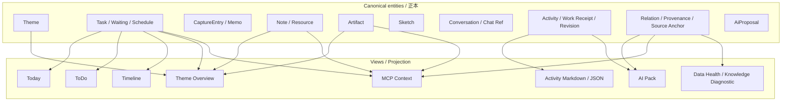

# Tasken Product Atlas

Taskenの全貌を、画面一覧ではなく「人間が何をするか」「どの正本データを扱うか」「どの機能が日常利用か」の3軸で把握するための地図。

> Status: Draft / 2026-08-10
>
> この文書は機能を増やすためではなく、重複・埋没・責務の曖昧さを見つけ、残す／統合する／畳む判断に使う。

## 1. Human Work Loop

```mermaid
flowchart LR
  subgraph INPUT[Capture / 人間から入れる]
    QC[Quick Capture]
    INBOX[Inbox]
    MEMO[Memo / Sticky]
    TEXT[Text / Markdown]
    SKETCH[Sketch]
    FILE[File / Screenshot paste]
    CHAT[AI Conversation Import]
    AUDIO[Voice Capture · Experimental]
    VIDEO[Screen Recording · Research]
  end

  subgraph CLARIFY[Clarify / 意味を与える]
    TASK[Task]
    WAIT[Waiting]
    DOC[Note / Report / Prompt]
    RESOURCE[Resource]
    ARTIFACT[Artifact]
    CHATREF[Chat Ref]
    REL[Relation / Source Anchor]
  end

  subgraph WORK[Work / 実行する]
    TODAY[Today]
    TODO[ToDo]
    FOCUS[Focus]
    TIMELINE[Timeline]
    THEME[Theme Overview]
  end

  subgraph PRODUCE[Produce / 成果を残す]
    MD[Canonical Markdown]
    PDF[PDF / PowerPoint]
    MEDIA[Image / Audio / Video]
    WEB[Web Artifact · Experimental]
    RECEIPT[Work Receipt]
  end

  subgraph REUSE[Recall & AI / 再利用する]
    ACTIVITY[Activity Event Index]
    CONTEXT[AI Context Preview / Pack]
    MCP[MCP / Coding Agent]
    PROPOSAL[AI Inbox / Proposal Review]
    GRAPH[Provenance / Context Graph]
  end

  INPUT --> CLARIFY --> WORK --> PRODUCE --> REUSE
  REUSE -. new task / note / proposal .-> CLARIFY
```



### 読み方

- `Capture`は入口であり、最終的な情報分類ではない。
- `Today / ToDo / Timeline / Theme`は別々のTask正本ではなく、同じTask群の異なるProjection。
- `Note / Report / Prompt`は同じDocument Workbench上の意味付け。
- `Artifact`は成果物の正本。画像・音声・動画・Web等はArtifactのmedia/view capability。
- `Knowledge / Graph`は日常入力棚ではなく、Relation・Provenance・AI Contextの診断／研究面。

## 2. Surface Map

| Surface | 一言で言うと | 主に扱う正本 | 種別 | 現在の位置づけ |
|---|---|---|---|---|
| Today | 今日実行する | Task / Schedule | Projection / Hub | Core daily |
| ToDo | 未完了・予定なしを整理する | Task / Schedule | Projection | Core daily |
| Waiting | 外部待ちを確認する | Waiting | Entity view | Supporting / usage review |
| Inbox | まだ意味を決めていない入力 | CaptureEntry / Memo | Intake hub | Core daily, simplify |
| Timeline | 中長期計画をTheme横断で見る | Task / Schedule | Projection | Supporting |
| Notes | Markdown文書を作る・読む | Note / Resource | Workbench | Core daily |
| Sketch | 手描き・図を作る | Sketch | Authoring tool | Core secondary |
| Chat Refs | 外部AI会話を保管・参照する | Resource / Conversation | Source library | Supporting, growing |
| Artifacts | 実ファイル・Media・Web成果物 | Artifact | Output library | Core, growing |
| Theme | 一つのThemeの現在地 | Theme + related entities | Projection / Context | Core |
| Themes | Theme横断の一覧 | Theme | Portfolio view | Supporting |
| AI Inbox | AIからの変更案を確認する | AiProposal | Review boundary | Supporting / Experimental |
| Knowledge | Relation・既存Knowledgeを診断する | Relation / KnowledgeNode | Research / Diagnostic | Experimental |
| Settings | 保存・接続・AI・表示を設定する | Preferences / Profiles | Tool | Supporting |

### Satellite surfaces

| Surface | 役割 | 正本 |
|---|---|---|
| Quick Capture | どこからでも入力 | CaptureEntry / Task等 |
| Sticky Memo | Memoをデスクトップ表示 | 同じMemo Entity |
| Today Mini | Todayを小窓表示 | 同じTask Projection |
| Detached Note | Noteを別Windowで編集 | 同じNote Entity |
| Media Recorder | Voice / Screen Recording | CaptureEntry + Artifact |

Satellite Windowは新しい正本を作らず、本体と同じCommand・Selector・Preferenceを利用する。

## 3. Canonical Data vs Projection



### 原則

- Projectionを別Entityの正本にしない。
- 同じ操作を複数画面から行っても、同じApplication Commandを通す。
- 表示面を削除しても、正本Entity・Relation・履歴を直ちに削除しない。

## 4. Overlap Clusters

### Capture cluster

```text
Quick Capture / Inbox / Memo / Sticky Memo / Voice Capture
```

同じ役割ではないが、いずれも「まだ意味が確定していない入力」を扱う。

- Quick Capture: 入力手段
- Inbox: 整理場所
- Memo: 軽量な内容
- Sticky: MemoのPresentation
- Voice: Capture source

別Entityを増やすより、Capture source・content type・presentationを分ける。

### Task projection cluster

```text
Today / ToDo / Timeline / Theme Overview / Today Mini
```

すべてTask・Scheduleの異なる見方。Taskの状態・日付・Theme判定を独自実装しない。

Taskのtransport正本は `src/shared/contracts/task/public.ts` とする。ここが
Command / Query / Event / Error / read modelのversioned schemaを所有し、各Projectionは
独自のTask contractを作らない。SQLite row、Main domain、Renderer view/form stateは
別の役割として保ち、#404/#405/#406でこの正本へ順にadapter接続する。

### Document cluster

```text
Note / Report / Prompt / Resource / canonical Markdown
```

同じDocument Workbenchを共有する。違いは用途・metadata・authorityであり、Editor・保存・検索・Windowを二重実装しない。

### Source / output cluster

```text
Resource / Chat Ref / Artifact / Web Artifact / Media Artifact
```

- Resource: 外部情報・資料の参照
- Chat Ref: 外部AI会話という特殊なSource
- Artifact: 実ファイル／成果物
- Web / Media: Artifactの表示・処理能力

URL、本文、ファイル、会話ログを一つの曖昧な「関連資料」に潰さない。

### AI cluster

```text
Note AI / AI Inbox / MCP / AI Pack / Context Preview / Provider Settings
```

- Note AI: 生成・相談
- AI Inbox: 書き込み案の人間確認
- MCP: 外部Agentとの読取・作業報告
- AI Pack: OneDrive向けProjection
- Context Preview: 渡す内容の確認
- Provider Settings: 接続・能力

同じAI機能ではなく、AI境界の異なる段階。

### History / provenance cluster

```text
Activity Event / Work Receipt / Status Update / Plan Revision / Relation
```

「いつ何が起きたか」「誰が何をしたか」「何から生まれたか」を共通Event / Provenance契約へ寄せる。

## 5. Maturity Legend

全capabilityへ次の状態を一つ付ける。

| State | 意味 | UI原則 |
|---|---|---|
| `core` | 日常ループの中心 | 主導線へ置く |
| `supporting` | 特定場面で明確に使う | 二次導線／Contextual UI |
| `experimental` | 価値検証中 | Experimental表示、撤去可能な境界 |
| `diagnostic` | 研究・修復・状態確認 | Settings / Advanced / Knowledge等 |
| `dormant` | 現在ほぼ使っていない | 隠す／畳む／再設計判断 |
| `deprecated` | 置換済み | 新規作成不可、移行・読取のみ |

現時点の仮置き:

```text
core:
  Today, ToDo, Inbox, Notes, Theme, Artifacts

supporting:
  Waiting, Timeline, Themes, Sketch, Chat Refs, Settings, AI Inbox

experimental:
  Voice Capture, Screen Recording, Web Artifact, Source Anchor, Note AI再設計

diagnostic:
  Knowledge / Context Graph diagnostics, Data Health
```

利用実態を確認して変更する。

## 6. Feature Registry案

地図を手更新だけにせず、各capabilityをregistryへ登録する。

```ts
type FeatureDefinition = {
  id: string;
  label: string;
  purpose: string;
  maturity: "core" | "supporting" | "experimental" | "diagnostic" | "dormant" | "deprecated";
  canonicalEntities: string[];
  primarySurface?: string;
  secondarySurfaces?: string[];
  entryPoints: string[];
  expectedFrequency: "daily" | "weekly" | "occasional" | "research";
  replacement?: string;
  relatedIssues?: number[];
};
```

Route、Command Palette、Settings、Experimental badge、Product Atlasを同じ定義から投影する。

UI component単位ではなく、利用者にとって意味のあるcapability単位で登録する。

## 7. Local Feature Census

外部telemetryは送らず、端末内だけで次を集計する。

- Entity件数と最終作成・更新時刻
- route / satellite windowの最終利用時刻と概算回数
- primary commandの最終実行時刻と概算回数
- dataは存在するが入口が無い機能
- routeはあるが長期間利用されない機能
-同じcapabilityに複数primary entryがある状態

### 表示例

| Capability | Maturity | Last used | Data | Entrypoints | Finding |
|---|---|---:|---:|---:|---|
| Notes | core | today | 184 | 3 | healthy |
| Waiting | supporting | 64 days | 2 | 1 | review |
| Knowledge manual create | dormant? | never | 7 | 2 | UI may be unnecessary |
| AI Inbox | supporting | 21 days | 4 | 1 | occasional, keep contextual |

利用回数だけで自動削除・降格しない。判断材料として使う。

## 8. Audit Rules

`npm run audit:features`等で次を検出する。

- RouteにFeature Registry対応が無い
- Featureにprimary surfaceが複数ある
- Entityが存在するが、開くlocator / surfaceが無い
- 画面は存在するが目的・正本Entityが未定義
-同じlabelのactionが異なるCommandを呼ぶ
- experimental capabilityが通常導線へ無印で出ている
- deprecated capabilityから新規Entityを作れる
- README / routes / Product Atlasの名称が不一致

## 9. Product Decisions to Revisit

このAtlasを使って、定期的に次を判断する。

1. Waitingは独立画面を維持するか、Today / Taskの状態へ寄せるか
2. Timelineは中長期計画だけに絞れているか
3. Knowledge画面は診断面として十分か、通常ナビから下げるか
4. AI Inboxは独立画面か、Proposalがある時だけ現れるContextual入口か
5. Resource / Chat Ref / Artifactの違いが利用者に伝わるか
6. Activity / Work Receipt / Revisionを一つの来歴面で辿れるか
7. Experimental Media / Web / Pointingが通常UIを圧迫していないか

## 10. Update Rule

- 新しいTop Level route、Entity、Satellite Window、Experimental capabilityを追加するPRは、このAtlasを更新する。
- Featureを削除・統合した場合はreplacement / migrationを記録する。
- 四半期ではなく、実利用レビュー時に更新する。
- Issue一覧をProduct Atlasの代わりにしない。Issueは作業、Atlasは現在の製品像を表す。
