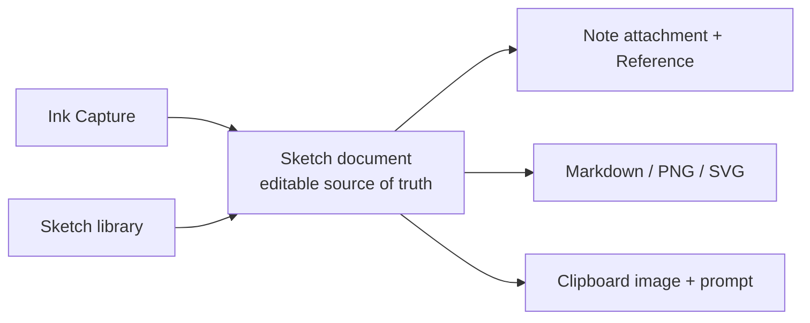

# Sketch workspace

## 目的

文字、数式、矢印、簡単な図解をペンで素早く残し、その後のNote化・AIへの説明・共有へつなぐ。絵画アプリではなく、考える途中の線をTaskenの情報経路へ受け入れる作業面とする。

## 利用の一周

1. SidebarのKnowledgeにある「Sketch」またはInboxの「手書きで記録」から開始する。
2. Sketch棚で検索・Theme絞り込み・並び替えを行い、行を選ぶと詳細ドロワー、明示的に「開く」と編集面へ進む。
3. ペン、蛍光ペン、消しゴム、図形認識、矢印、テキスト、画像で複数ページを編集する。
4. 変更は短い遅延で自動保存され、再起動後も編集可能なオブジェクトとして復元する。
5. 必要に応じてMarkdown + PNG、PNG、SVGへ書き出すか、画像と説明用プロンプトをクリップボードへコピーして外部AIへ渡す。
6. Sketchのタイトル・Theme変更と削除は詳細ドロワーから行う。削除は論理削除し、undoできる。
7. Note埋め込みはNote側から既存Sketchを選び、埋め込みから元Sketchを再編集できる経路へ置換する（#216）。置換までは既存のPNG添付＋Reference経路を維持する。

## 正本と派生物

`Sketch.document`のschema versionは1。各ページは寸法・背景・オブジェクト配列を持つ。オブジェクトは筆圧付きstroke、高lighter、shape、arrow、text、image。PNGやSVGは都度レンダリングし、編集データの代用にはしない。

## 初期実装の機能範囲

- coalesced pointer入力と曲線平滑化、描画中から色・太さ・筆圧を反映するペン／蛍光ペン、ストローク消去
- 矩形・楕円・直線の手書き認識、矢印
- 明示的に切り替えるまで継続する図形・矢印・テキスト作成、Enter／フォーカス移動で確定するインラインテキスト
- ファイル選択とクリップボード貼り付け（最後に指した位置）による画像挿入
- 選択、投げ縄選択、操作中から追従する移動・リサイズ、辺・中心の整列ガイド、複数選択、複製
- Undo / Redo、Delete、Ctrl+A、Ctrl+C/V、Ctrl+D、Ctrl+Z/Y
- 複数Sketch、複数ページ、ページ背景、ズーム
- 自動保存、Snapshot、論理削除
- Note挿入、Markdown + PNG / PNG / SVG、AI向けコピー

## 非交渉の互換条件

- 既存のNotesとSnapshotがそのまま読める。
- RendererからSQLiteへ直接書かない。
- 保存失敗時は編集中のdocumentを画面に残す。
- Exportは派生処理でありSketch正本を書き換えない。
- Sketch棚から開始してもInk Captureから開始しても同じSketch編集面へ合流する。
