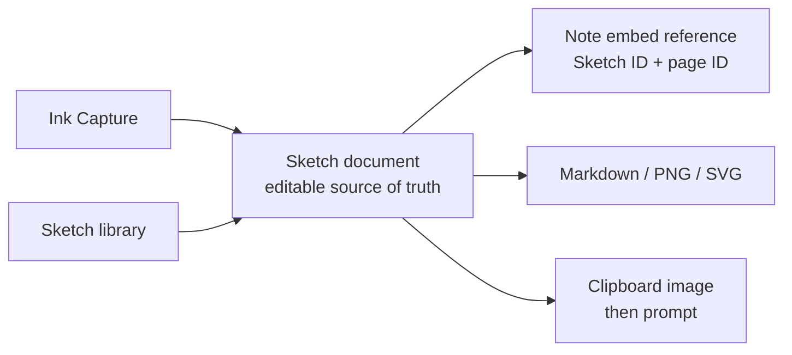

# Sketch workspace

## 目的

文字、数式、矢印、簡単な図解をペンで素早く残し、その後のNote化・AIへの説明・共有へつなぐ。絵画アプリではなく、考える途中の線をTaskenの情報経路へ受け入れる作業面とする。

## 利用の一周

1. SidebarのKnowledgeにある「Sketch」またはInboxの「手書きで記録」から開始する。
2. Sketch棚で検索・Theme絞り込み・並び替えを行い、行を選ぶと詳細ドロワー、明示的に「開く」と編集面へ進む。
3. ペン、蛍光ペン、消しゴム、図形認識、明示図形、矢印、再編集できるテキスト、画像で複数ページを編集する。色と太さは道具ごとに記憶する。
4. 変更は短い遅延で自動保存され、再起動後も編集可能なオブジェクトとして復元する。
5. 必要に応じてMarkdown + PNG、PNG、SVGへ書き出す。外部AIへ渡す場合は「1. AIへ画像をコピー」で画像を貼り、その後「2. AI向け指示をコピー」で同じ会話へ指示を貼る。
6. Sketchのタイトル・Theme変更と削除は詳細ドロワーから行う。削除は論理削除し、undoできる。
7. Note埋め込みはNote Edit側のカーソル位置から既存Sketchとページを選ぶ。本文には`tasken-sketch:<sketch-id>/<page-id>`参照だけを保存し、Edit・Preview・PDFの画像は現在のSketch正本から生成する。
8. Note Previewの埋め込みを押すと同じSketch・ページを編集面で開く。Sketchまたはページを削除してもNote本文は残し、参照切れを明示する。
9. 新規作成時にPageまたはInfiniteを選ぶ。比較条件と同一サンプルは[Canvas mode comparison](./sketch-canvas-modes.md)を正本とする。

## 正本と派生物

`Sketch.document`のschema versionは1。`mode`は`page | infinite`で、省略された既存データは`page`として読む。各ページは寸法・背景・オブジェクト配列を持つ。オブジェクトは筆圧付きstroke、高lighter、shape、arrow、text、image。PNGやSVGは都度レンダリングし、編集データの代用にはしない。

## 初期実装の機能範囲

- coalesced pointer入力と曲線平滑化、描画中から色・太さ・筆圧を反映するペン／蛍光ペン、ストローク消去
- 矩形・楕円・直線の手書き認識に加え、直線・矩形・楕円・三角の明示作成、矢印
- ペン／蛍光ペン／消しゴム等が個別に色と太さを記憶し、選択中の道具に必要な設定だけを表示
- 明示的に切り替えるまで継続する図形・矢印・テキスト作成、Enter／フォーカス移動で確定しダブルクリックまたは選択操作から再編集できるインラインテキスト
- ファイル選択とクリップボード貼り付け（最後に指した位置）による画像挿入
- 輪郭を基準にした選択、投げ縄選択、操作中から追従する移動・リサイズ、辺・中心の整列ガイド、複数選択、複製、最前面／最背面
- Undo / Redo、Delete、Ctrl+A、Ctrl+C/V、Ctrl+D、Ctrl+Z/Y
- 複数Sketch、複数ページ、ページ背景、ズーム
- Page / Infiniteの作成時選択、Infiniteのpan・zoom・右下方向への自動拡張、描画範囲／全体Export
- 自動保存、Snapshot、論理削除
- Note側からの参照埋め込み・再編集、Markdown + PNG / PNG / SVG、AI向けコピー

## キャンバス移動

- 通常ホイール: 縦スクロール
- `Shift` + ホイール: 横スクロール
- 中ボタン + ドラッグ: 表示位置を自由移動
- `Space` + 左ドラッグ: 選択中の描画ツールを保ったまま一時的に表示位置を移動
- `Ctrl`（macOSでは`Cmd`）+ ホイール: カーソル位置を基準に拡大縮小

これらはPageとInfiniteで共通とし、画面右下の拡大・縮小・全体表示ボタンも同じ倍率状態を操作する。

## AIへ渡す

Windowsでは同じクリップボードへ画像と文字列を同時に書いても、貼り付け先が片方だけを採用することがある。このためTaskenは画像と指示を混在させず、次の2操作に分ける。

1. 「1. AIへ画像をコピー」を実行し、AIの入力欄へ貼り付ける。TaskenはPNGを書いた直後に画像の寸法を読み戻し、書き込みを確認する。
2. 「2. AI向け指示をコピー」を実行し、画像を貼った同じ会話へ続けて貼り付ける。

画像を扱えない入力欄ではPNG書き出しを添付し、「2. AI向け指示をコピー」だけを使う。失敗時は原因と再試行方法を画面に残す。

## 非交渉の互換条件

- 既存のNotesとSnapshotがそのまま読める。
- RendererからSQLiteへ直接書かない。
- 保存失敗時は編集中のdocumentを画面に残す。
- Exportは派生処理でありSketch正本を書き換えない。
- Sketch棚から開始してもInk Captureから開始しても同じSketch編集面へ合流する。
