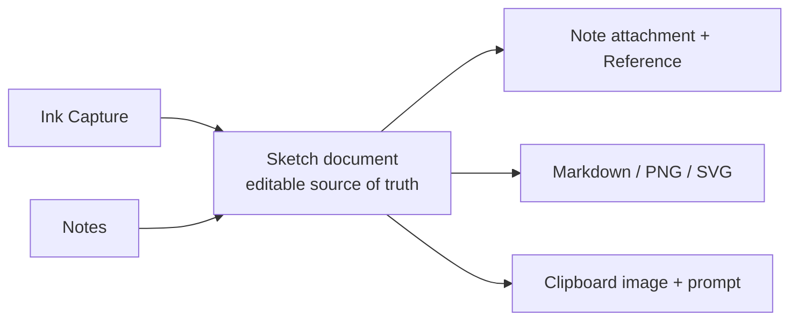

# Sketch workspace

## 目的

文字、数式、矢印、簡単な図解をペンで素早く残し、その後のNote化・AIへの説明・共有へつなぐ。絵画アプリではなく、考える途中の線をTaskenの情報経路へ受け入れる作業面とする。

## 利用の一周

1. Inboxの「手書きで記録」またはNotesの「Sketchを開く」から開始する。
2. ペン、蛍光ペン、消しゴム、図形認識、矢印、テキスト、画像で複数ページを編集する。
3. 変更は短い遅延で自動保存され、再起動後も編集可能なオブジェクトとして復元する。
4. 必要に応じてNoteへPNGを挿入する。元SketchへのReferenceを同時に保存する。
5. Markdown + PNG、PNG、SVGへ書き出すか、画像と説明用プロンプトをクリップボードへコピーして外部AIへ渡す。
6. Sketchを削除した場合は論理削除し、関連Referenceだけを連動して論理削除する。

## 正本と派生物

`Sketch.document`のschema versionは1。各ページは寸法・背景・オブジェクト配列を持つ。オブジェクトは筆圧付きstroke、高lighter、shape、arrow、text、image。PNGやSVGは都度レンダリングし、編集データの代用にはしない。

## 初期実装の機能範囲

- ペン入力と筆圧、蛍光ペン、ストローク消去
- 矩形・楕円・直線の手書き認識、矢印
- テキスト、画像挿入
- 選択、投げ縄選択、移動、リサイズ、複製
- Undo / Redo
- 複数Sketch、複数ページ、ページ背景、ズーム
- 自動保存、Snapshot、論理削除
- Note挿入、Markdown + PNG / PNG / SVG、AI向けコピー

## 非交渉の互換条件

- 既存のNotesとSnapshotがそのまま読める。
- RendererからSQLiteへ直接書かない。
- 保存失敗時は編集中のdocumentを画面に残す。
- Exportは派生処理でありSketch正本を書き換えない。
- Captureから開始してもNotesから開始しても同じSketch編集面へ合流する。
